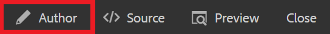

# Skapa en karta

En karta är ett organiseringsverktyg där du kan lägga till och ordna information i en hierarkisk struktur. Den här åtgärden visar hur du skapar en karta och organiserar innehåll på kartan.

Du kan hämta exempel på DITA-filer här:

* [Documents-with-Visual-Content.dita](assets/working-with-maps/Documents-with-Visual-Content.dita)
* [Working-with-Tables.dita](assets/working-with-maps/Working-with-Tables.dita)

>[!VIDEO](https://video.tv.adobe.com/v/336725?quality=12&learn=on)

## Överför kartkomponenter

Om du vill kan du överföra lokala exempelfiler till AEM för en mer komplett uppsättning material.

1. Dra och släpp lokala filer i AEM för att överföra dem.
1. Upprepa efter behov för alla filer, inklusive bilder och ämnen.

## Skapa en karta

1. Öppna [!UICONTROL Options] väljer du ellipsikonen i huvudmappen.

   

1. Välj **[!UICONTROL Create]** > **[!UICONTROL Map]**.

   

   The [!UICONTROL Create New Map] visas.

1. I [!UICONTROL Template] fält, markera **[!UICONTROL Bookmap]** i listrutan och ge kartan en titel.
1. Välj **[!UICONTROL Create]**.

   Kartan skapas och den vänstra listen ändras automatiskt från databasvyn till kartvyn.

## Infoga kartkomponenter

1. Välj pennikonen i den vänstra listen.

   

   Det här är redigeringsikonen och du kan öppna kartan i redigeraren.

1. Växla tillbaka till databasvyn genom att välja ikonen Databas.

   

1. Lägg till ett ämne på kartan genom att dra och släppa det från databasen till kartan i redigeraren.

   Radindikatorn visar var ämnet är placerat.

1. Fortsätt lägga till ämnen efter behov.

## Visa en förhandsgranskning av kartan

Med Förhandsgranska får du en snabb överblick över innehållet med standardformat. Här visas rubriker, stycken, listor och annat innehåll i avsnitten som visas.

1. Välj **[!UICONTROL Preview]** på den övre svarta menyraden.

   

Ditt innehåll öppnas i [!UICONTROL Preview].

1. Om du vill återgå till redigeringsvyn och återuppta redigering av kartor väljer du **Författare.**

   

## Konfigurera mappningsstruktur

Du kan redigera ämneshierarkin i kartan.

1. Klicka på ett ämnes ikon för att markera det.
2. Använd pilarna för att nedgradera respektive höja upp element.

   

## Spara kartan som en ny version

Nu när kartan är klar kan du spara ditt arbete som en ny version och registrera dina ändringar.

1. Välj **[!UICONTROL Save as New Version]** ikon.

   

1. I fältet Kommentarer för den nya versionen anger du en kort men tydlig sammanfattning av ändringarna.

1. Ange eventuella relevanta etiketter i fältet Versionsetiketter.

   Med etiketter kan du ange vilken version du vill inkludera vid publicering.

   >[!NOTE]
   > 
   > Om ditt program är konfigurerat med fördefinierade etiketter kan du välja bland dessa för att säkerställa en konsekvent etikettering.

1. Välj **Spara**.

   Du har skapat en ny version av kartan och versionsnumret uppdateras.
