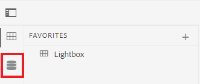
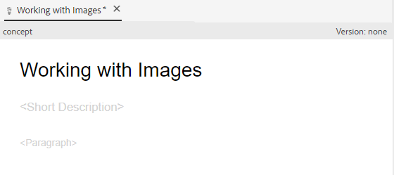

# Skapa och strukturera innehåll

När du har lärt dig användargränssnittet kan du börja skapa och strukturera ditt eget innehåll.

>[!VIDEO](https://video.tv.adobe.com/v/336657?quality=12&learn=on)

## Skapa en mapp

1. Välj **Databas** om du vill visa dina mappar och filer.

   

1. Välj **+** ikon och **Mapp**.

   

1. Ge mappen en titel.
1. Välj **Skapa**.
Du har skapat en ny mapp som nu visas i databasen. Den här mappen blir ditt hem för allt kursinnehåll.

## Skapa en undermapp

Nu kan vi skapa en mapp i den nya mappen som innehåller bilder eller annat innehåll.

1. Håll muspekaren över den nya mappen i databasen och välj ellipsikonen som visas.

   

   Menyn Alternativ visas.

1. Välj **Skapa mappen \>**.
   

1. Ge undermappen en titel (till exempel &quot;bilder&quot;) och välj **Skapa**.

## Skapa och fylla i ett nytt koncept

1. Håll markören över den överordnade mappen i databasen och välj ellipsikonen.

   

   Menyn Alternativ visas.

1. Välj **Skapa \> ämne**.

   

   Dialogrutan Skapa nytt ämne visas.

1. I listrutan Mall i dialogrutan väljer du **Koncept**.

   

1. Ge ditt koncept en titel och välj **Skapa**.

   Det nya konceptet visas i redigeraren, ifyllt med titeln.

   

1. Fyll i konceptet genom att klicka antingen i den korta beskrivningen eller i stycket och skriva ditt innehåll.

## Spara och spara som ny version

Du kan spara ditt arbete när som helst med Spara eller Spara som ny version. Använd Spara för att behålla ändringarna och använd Spara som ny version för att skapa en ny version av ämnet med aktuella ändringar.

### Spara ditt arbete utan versionshantering

1. Välj **Spara** ikon.

   

### Spara som ny version

1. Välj **Spara som ny version** till höger om ikonen Spara.

   

   Dialogrutan Spara som ny version visas.

1. I fältet Kommentarer för den nya versionen anger du en kort men tydlig sammanfattning av ändringarna.
1. Ange eventuella relevanta etiketter i fältet Versionsetiketter.

   Med etiketter kan du ange vilken version du vill inkludera vid publicering.

   >[!NOTE]
   > 
   > Om ditt program är konfigurerat med fördefinierade etiketter kan du välja bland dessa för att säkerställa en konsekvent etikettering.

1. Välj **Spara**.

   Du har skapat en ny version av ämnet och versionsnumret uppdateras.
