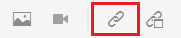
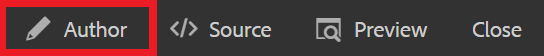
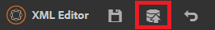

# Länka till webbplatser

Webblänkar dirigerar läsare till webbplatser för mer information, gör det möjligt för dem att interagera med externt innehåll eller ge åtkomst till hämtningsbara filer. Följande steg visar hur du lägger till en webblänk till ett befintligt koncept.

>[!VIDEO](https://video.tv.adobe.com/v/336656?quality=12&learn=on)

## Infoga en länk

1. Välj ditt koncept i databasen och öppna det i redigeraren.
2. Lägg till en textsträng i konceptet och markera den eller markera befintlig text.

   Den markerade texten är den plats där länken infogas.
3. Välj **Infoga korsreferens** från verktygsfältet.

   

   Dialogrutan Referens visas.

4. Välj **Webblänk** från den vänstra menyn.
5. Klistra in önskad URL och klicka sedan **Välj**.

   Länken fungerar och en webbsida öppnas i en ny webbläsarflik när någon klickar på den.

## Testa länkar med Förhandsgranska

Med knappen Förhandsgranska kan du se en förhandsgranskning av ett ämne. Här kan du testa länkarna och visa dem som din målgrupp skulle.

1. Välj **Förhandsgranska** på den övre svarta menyraden.

   

   Ditt koncept öppnas i Förhandsgranska.

1. Markera länken.
Länkmålet öppnas på en annan flik.
1. Återgå till redigeringsvyn genom att välja **Upphovsman** på den övre svarta menyraden.

   

## Spara som ny version

Nu när du har lagt till mer innehåll i ditt koncept kan du spara ditt arbete som en ny version och registrera ändringarna.

1. Välj **Spara som ny version** ikon.

   

1. I fältet Kommentarer för den nya versionen anger du en kort men tydlig sammanfattning av ändringarna.
1. Ange eventuella relevanta etiketter i fältet Versionsetiketter.

   Med etiketter kan du ange vilken version du vill inkludera vid publicering.

   >[!NOTE]
   > 
   > Om ditt program är konfigurerat med fördefinierade etiketter kan du välja bland dessa för att säkerställa en konsekvent etikettering.

1. Välj **Spara**.

   Du har skapat en ny version av ämnet och versionsnumret uppdateras.
