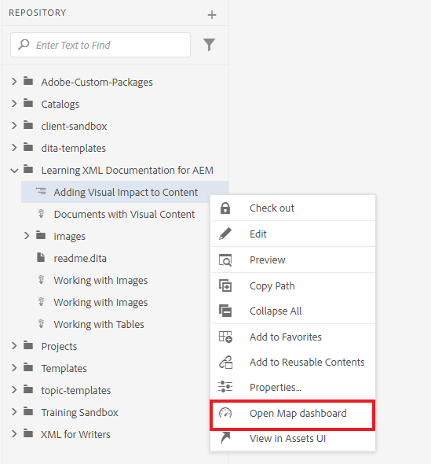
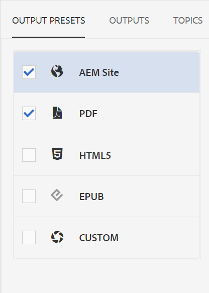
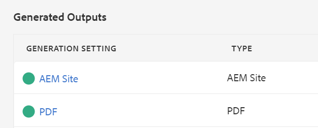

# Standardutdata för publicering

När kartan är klar kan du publicera innehållet i flera olika format.

>[!VIDEO](https://video.tv.adobe.com/v/336662?quality=12&learn=on)

## Publicera kartan som AEM och PDF

Det finns ett antal tillgängliga förinställningar att välja mellan. Den här guiden fokuserar på utdata från AEM och PDF.

1. I databasen väljer du ellipsikonen på kartan för att öppna Alternativ-menyn och sedan **Öppna på kartkontrollpanelen.**

   

   Kartkontrollpanelen öppnas på en annan flik.

1. På fliken Utdatainställningar väljer du AEM Plats och PDF.

   

1. Välj **Generera.**

1. Navigera till sidan Utdata för att visa status för dina genererade utdata.

   En grön cirkel visar att genereringen är klar.

   

## AEM webbplatsutdata

I utdata från AEM webbplats publiceras ämnen, listor, bilder, titlar, tabeller och annat innehåll som skapats med XML-redigeraren automatiskt till webbvänligt innehåll av AEM.

Du kan se underordnade ämnen i innehållsförteckningen samt i avsnittet Relaterad information. De här länkarna kan användas för att navigera.

## Utdata från PDF

Det färdiga PDF-dokumentet innehåller kartans standardtitel som huvudtitel på försättsbladet. Kapitelomslagssidor är formaterade med kapitelnumret och innehåller länkar till avsnitten i dem.
