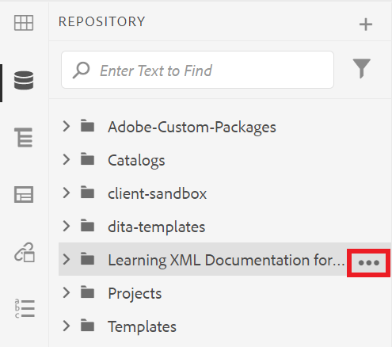
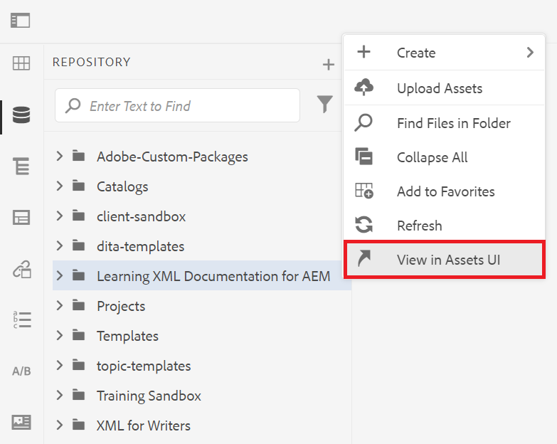
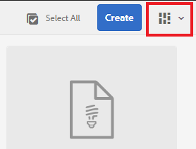
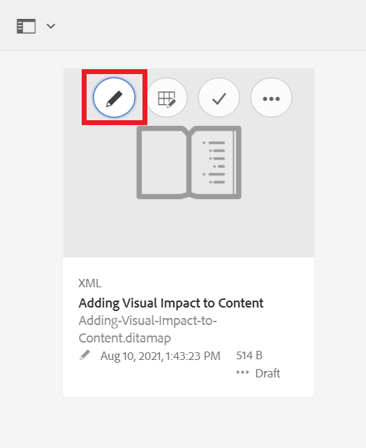

# Förstå AEM användargränssnitt

Läs om hur du hanterar resurser, filer och mappar i XML-redigeraren för Experience Manager.

>[!VIDEO](https://video.tv.adobe.com/v/336659?quality=12&learn=on)

## Åtkomst till XML-redigeraren

1. Ange ditt användarnamn och lösenord och välj **[!UICONTROL Sign In]**.
1. Välj **[!UICONTROL XML Editor]** på AEM navigeringssida.

## XML-redigeringsvyer

I sidofältet kan du välja bland flera vyer för XML-redigeraren så att den passar din organisation. De innehåller standardvyn och [!UICONTROL Repository View].

I standardvyn visas [!UICONTROL Favorites]. Du kan anpassa den ytterligare med kortkommandon efter behov. Omvänt gäller att [!UICONTROL Repository View] visar en mer traditionell mappstruktur.

### Växla till [!UICONTROL Repository View] från standardvyn

1. Välj **[!UICONTROL Repository View]**.

   

   The [!UICONTROL Repository View] visas.

## Användargränssnittet Resurser

I [!UICONTROL Assets] gränssnitt, kan du visa

### Visa innehåll i resursgränssnittet

Du kan utföra ytterligare åtgärder med innehållet. Ett av dessa alternativ är att visa filen i resursgränssnittet.

1. Håll muspekaren över en mapp eller ett ämne i databasen och välj ellipsikonen som visas.

   

   Menyn Alternativ visas.

1. Välj **Visa i resursgränssnitt.**

   

### Välja en vy

Du kan välja bland flera vyer för resursgränssnittet så att det passar din organisation bäst.

1. Välj **Visa växlare** i det övre högra hörnet.

   

   En nedrullningsbar meny visas.

1. Markera den vy som du vill arbeta med.

### Resurser, gränssnittsvyer

| Namn | Beskrivning |
| --- | --- |
| Kortvy | Visar varje resurs som en ikon |
| Kolumnvy | Visar resurser i en komprimerad, utbyggbar mappstruktur |
| Listvy | Visar resurser i en lista tillsammans med deras detaljer |

## Återgå till XML-redigeraren

Du kan gå tillbaka till XML-redigeraren från vilken vy som helst i resursgränssnittet.

### Returnera från list- och kolumnvy

1. Markera det ämne du vill redigera i listan.
Avsnittet visas i resursgränssnittet.
1. Välj **Redigera** i det övre verktygsfältet.
Du återgår till XML-redigeraren.

### Returnera från kortvyn

1. Välj pennikonen på ett ämne i [!UICONTROL Assets] Gränssnitt.

   

   Du återgår till XML-redigeraren.
