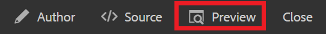

# Versionsinnehåll

När du versionshanterar ett dokument skapas en ögonblicksbild av det aktuella läget. Om du skapar flera versioner av ett ämne eller en karta kan du hålla reda på dina ändringar och återställa äldre arbete.

>[!VIDEO](https://video.tv.adobe.com/v/336724?quality=12&learn=on)

## Skapa en ny version

1. Välj ikonen Spara som ny version.

   

   Dialogrutan Spara som ny version visas.

1. I fältet Kommentarer för den nya versionen anger du en kort men tydlig sammanfattning av ändringarna.
1. Ange eventuella relevanta etiketter i fältet Versionsetiketter.

   Med etiketter kan du ange vilken version du vill inkludera vid publicering.

   >[!NOTE]
   > 
   > Om ditt program är konfigurerat med fördefinierade etiketter kan du välja bland dessa för att säkerställa en konsekvent etikettering.
1. Välj **Spara**.

   Du har skapat en ny version av ämnet och versionsnumret uppdateras. Den första versionen av ett dokument blir version 1.0.

## Visa versionshistorik

När du har flera versioner av ditt innehåll kanske du vill utforska skillnaderna mellan dem.

1. Välj ikonen Versionshistorik i verktygsfältet.

   

   Dialogrutan Versionshistorik visas.

1. Välj en version i listrutan som du vill jämföra den aktuella versionen med.

   Ändringarna från version till version anges.

## Återställa till markerad version

Om det behövs kan du välja en version och återställa den. På så sätt kan du ta bort den aktuella versionen och återgå till att arbeta med en tidigare version.

1. I dialogrutan Versionshistorik väljer du den version du vill återställa till i listrutan.
1. Välj **Återställ till markerad version**.

Dialogrutan Återställ version visas.

1. Lägg till en beskrivande kommentar om varför du återgår till en tidigare version.
1. Välj **Bekräfta**.

   Ämnet har återgått till den specifika versionen.

## Använda filter för att jämföra versioner

Du kan också visa versionsskillnader i förhandsvisning med hjälp av filtren Spåra och Visa skillnader i den högra listen.

1. Välj **Förhandsgranska** på den övre menyraden.

   

   Ämnet öppnas i Förhandsgranska.

1. I listrutan Spärra/knip till höger väljer du **Visa markering**.
1. I listrutan Visa skillnader väljer du den version du vill jämföra med.

   Ändringarna visas som formaterat innehåll.
