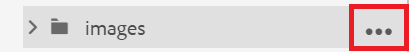
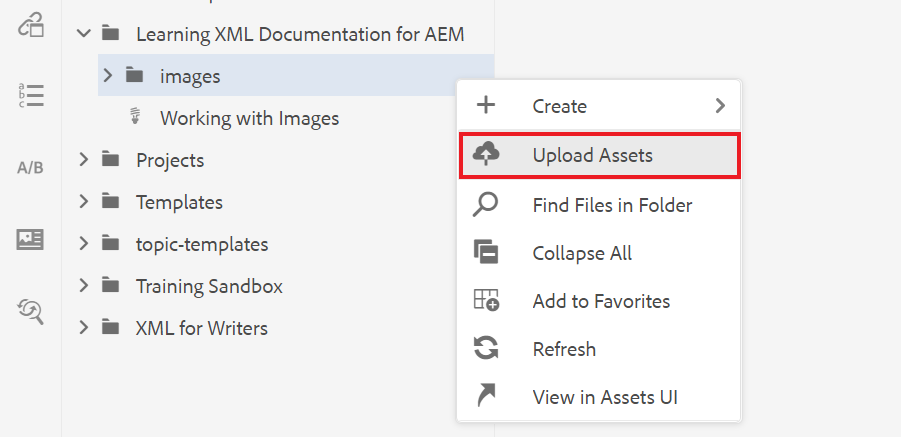
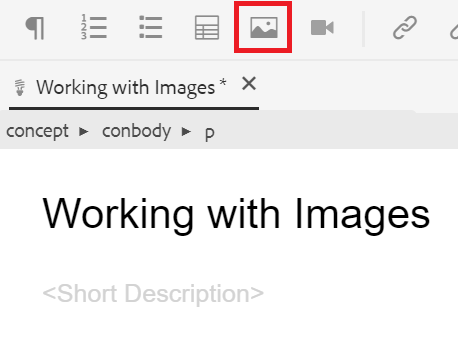
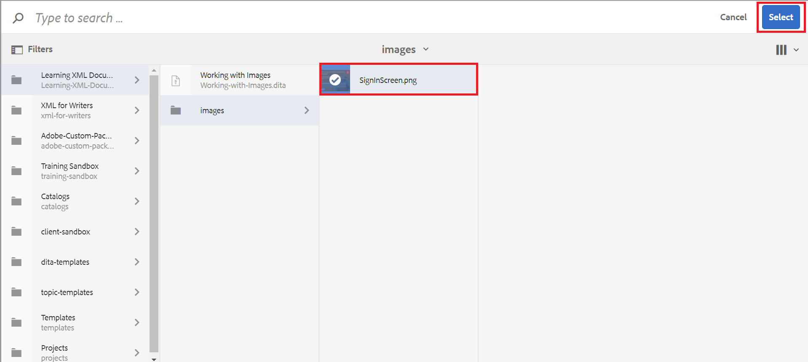

# Arbeta med bilder

Här får du hjälp med att ladda upp och infoga en bild samt med att spara en ny version av ett ämne.

Du kan hämta exempelbildfilen från [här.](assets/working-with-images/SignInScreen.png)

>[!VIDEO](https://video.tv.adobe.com/v/336661?quality=12&learn=on)

## Överföra en bild

1. Håll pekaren över undermappen och välj ellipsikonen för att öppna Alternativ-menyn.

   

1. Välj **[!UICONTROL Upload Assets]**.

   

1. Välj den bild som du vill överföra från ditt lokala system och välj **Öppna**.

   The [!UICONTROL Upload Assets] visas.
1. Välj **Överför**.

## Infoga en bild i ett ämne

Det finns flera sätt att infoga en bild i ditt ämne.

Du kan dra och släppa en bild från ditt lokala system till ämnet. Om bilden redan har överförts kan du även dra och släppa den direkt i ämnet från den vänstra listen. Du kan också använda knappen Infoga bild för att infoga bilder som för närvarande inte visas i den vänstra listen och för att ytterligare konfigurera bilden innan du infogar den.

Se till att ämnet är öppet i dokumentredigeraren för följande.

### Infoga en bild genom att dra och släppa

1. Välj bildfilen från det lokala systemet eller den vänstra listen och dra och släpp den i ämnet.

   Bilden visas i redigeraren.

### Infoga en bild med knappen Infoga bild

1. Välj **Infoga bild** ikon.

   

   Dialogrutan Infoga bild visas.

1. Välj mappikonen bredvid fältet Välj fil om du vill söka efter bilden eller navigera till platsen i databasen.
1. Markera bildens ikon och sedan **Välj**.

   

   Dialogrutan Infoga bild visas med information om den valda bilden.

1. Ange text i fälten Figure Title och Alternate Text efter behov.
1. Välj **Infoga**.

   Bilden visas i redigeraren tillsammans med bildens titel.

## Ta bort en bild från ett ämne

1. Markera bilden i dokumentredigeraren och tryck på **Ta bort** nyckel.

## Spara en ny version av ett ämne

Med versionshantering kan du granska och jämföra olika versioner. Du kan också backa till en tidigare version.

När du har gjort en betydande ändring i ämnet kan det nu vara bra att spara det aktuella arbetet som en ny version.

1. Välj **Spara som ny version** ikon.

   

   The **Spara som ny version** visas.

1. I fältet Kommentarer för den nya versionen anger du en kort men tydlig sammanfattning av ändringarna.
1. Ange eventuella relevanta etiketter i fältet Versionsetiketter.

   Med etiketter kan du ange vilken version du vill inkludera vid publicering.
   >[!NOTE]
   > 
   > Om ditt program är konfigurerat med fördefinierade etiketter kan du välja bland dessa för att säkerställa en konsekvent etikettering.
1. Välj **Spara**.

   Du har skapat en ny version av ämnet och versionsnumret uppdateras.
