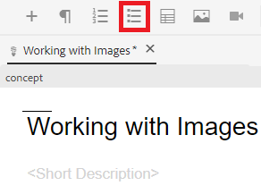
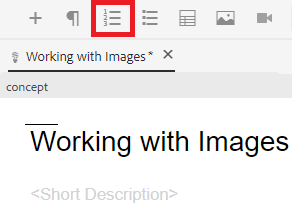

# Arbeta med listor

Du kan behöva punktlistor och numrerade listor för att kunna ordna dina uppgifter. Följande instruerar dig om hur du infogar och arbetar med listor i ett befintligt koncept.

>[!VIDEO](https://video.tv.adobe.com/v/336658?quality=12&learn=on)

## Punktlistor

En punktlista eller osorterad lista bör användas när listkomponenterna inte behöver ordnas i en viss ordning.

### Infoga en punktlista

1. Välj **Infoga punktlista** -ikonen i verktygsfältet.

   

   En punkt visas. Det här är början av listan.

1. Skriv in ditt första listobjekt.
1. Tryck på Retur för att skapa en andra post och skriva in innehållet.
1. Fortsätt lägga till listobjekt efter behov.

## Numrerade listor

En numrerad lista bör användas när listkomponenter behöver ordnas eller struktureras på ett visst sätt.

### Infoga en ordnad lista

1. Välj **Infoga numrerad lista** -ikonen i verktygsfältet.

   

   Ett tal visas. Det här är början av listan.

1. Skriv in ditt första listobjekt.
1. Tryck på Retur för att skapa en andra post och skriva in innehållet.
1. Fortsätt lägga till listobjekt efter behov.

## Spara som ny version

Nu när du har lagt till mer innehåll i ditt koncept kan du spara ditt arbete som en ny version och registrera ändringarna.

1. Välj **Spara som ny version** ikon.

   

1. I fältet Kommentarer för den nya versionen anger du en kort men tydlig sammanfattning av ändringarna.
1. Ange eventuella relevanta etiketter i fältet Versionsetiketter.

   Med etiketter kan du ange vilken version du vill inkludera vid publicering.

   >[!NOTE]
   > 
   > Om ditt program är konfigurerat med fördefinierade etiketter kan du välja bland dessa för att säkerställa en konsekvent etikettering.

1. Välj **Spara**.

   Du har skapat en ny version av ämnet och versionsnumret uppdateras.
