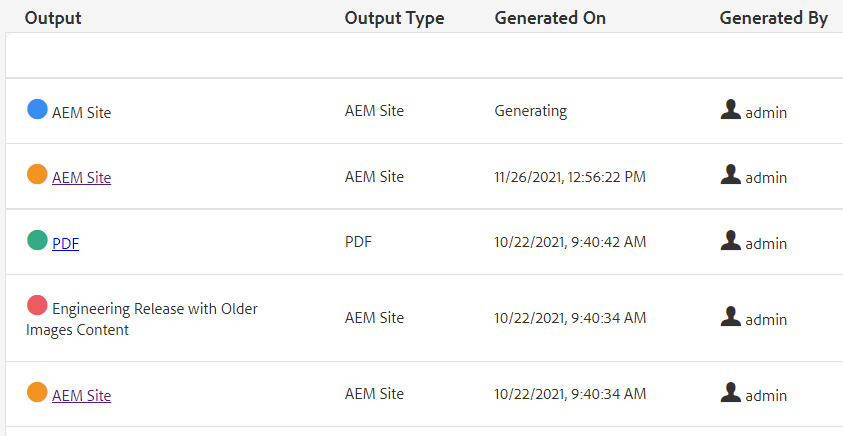

# Masspublicering

Vid publicering behövs ofta mer än en typ av dokumentation. Med Kartsamlingar kan du styra hur många utdata och typer av utdata som ska monteras och genereras och starta en bulkpublicering. På kontrollpanelen Publicera kan du visa aktiva publiceringsjobb. På kontrollpanelen Publicera gruppvis kan du aktivera samlingar gruppvis.

>[!VIDEO](https://video.tv.adobe.com/v/338985)

## Arbeta med kartsamlingar

Med Kartsamlingar kan du styra vilka typer av utdata som ska genereras för en eller flera kartor.

### Skapa kartsamlingar

1. På menyn Navigering klickar du på **Resurser**.

2. Välj Kartsamlingar.

3. Klicka **Skapa**.

4. Ange en samlingstitel.

   

5. Klicka **Skapa**.
6. Stäng meddelandet.

7. Öppna kartsamlingen (klicka på det grå avsnittet nedanför rutan)

8. Klicka **Redigera**.

9. Lägg till kartor efter behov.

10. Markera eller avmarkera **Förinställningar för utdata** för varje karta.

11. Klicka **Klar**.

### Förinställningar för filtreringskarta

1. Öppna en förinställning för karta.

2. Under **Filter** utöka och markera alternativ efter behov.

### Generera innehåll i en kartsamling

1. Öppna en förinställning för karta.

2. Om du vill kan du klicka **Generera alla**.

3. Du kan också välja kartor och utdatatyper att generera och klicka på **Generera markerade**.

4. Om det behövs växlar du till fliken Utdata.

5. Granska utdata.

## Visa aktiva publiceringsjobb i Publish Dashboard

På kontrollpanelen Publicera kan du visa aktiva publiceringsjobb. Den visar en dynamisk lista med kartor och deras aktuella status. Du kan spåra, hantera och avbryta publiceringsarbetsflöden.

1. I navigeringsvyn klickar du på **verktyg** ikon.

2. Klicka på **[!DNL Guides]**.

3. Välj **Publish Dashboard** platta.

       Om kontrollpanelen är tom körs inga publiceringsjobb.
       
   
4. Filtrera instrumentpanelen efter behov för att visa alla publiceringsjobb.

### Arbeta med kontrollpanelen för masspublicering

På kontrollpanelen Publicera gruppvis kan du arbeta med samlingar för gruppaktivering och styra flera typer av utdata.

### Skapa en gruppaktiveringssamling

1. I navigeringsvyn klickar du på **verktyg** ikon.

2. Klicka på **[!DNL Guides]**.

3. Välj **Publish Dashboard** platta.

4. Ange en samlingstitel.

5. Klicka **Skapa**.

6. Klicka **Öppna**.

7. Öppna kartsamlingen (klicka på det grå avsnittet nedanför rutan)

8. Klicka **Redigera**.

9. Lägg till kartor efter behov.

10. Markera eller avmarkera **Förinställningar för utdata** för varje karta.

11. Klicka **Klar**.

12. Stäng kartsamlingen när du är klar.

### Snabbpublicera en samling för massaktivering

1. Välj en gruppruta för aktiveringssamling.

2. Klicka **Öppna**.

3. Markera en eller flera kartor.

4. Klicka **Snabbpublicering**.
