# Skapa och publicera med baslinjer

Om du använder en baslinje kan du skapa en version av dina kartämnen och tillhörande referensinnehåll. Detta kan baseras på ett specifikt datum eller en viss tid eller etiketter.

>[!VIDEO](https://video.tv.adobe.com/v/338993)

## Åtkomst till fliken Baslinjer på kontrollpanelen för kartor

Du kan komma åt dina baslinjer på Map Dashboard.

1. Databasvyn: välj ellipsikonen på kartan för att öppna Alternativ-menyn. **Öppna kartkontrollpanelen.**

   
Kartkontrollpanelen öppnas på en annan flik.

2. Välj **Baslinjer**.

   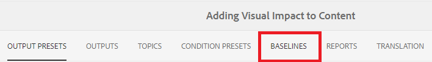

Fliken Baslinjer visas.

## Skapa en baslinje baserad på etiketter

1. På fliken Baslinjer väljer du **Skapa**.

   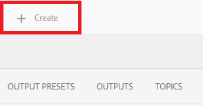

   Den nya baslinjens information visas. Standardnamnet baseras på det datum då filen skapades.

2. Ge baslinjen ett nytt namn om det behövs.

3. Under rubriken&quot;Ange versionen baserat på&quot; väljer du cirkeln för Etikett.
   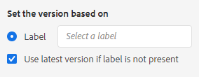

   >[!NOTE]
   >
   >OBS! The *Använd den senaste versionen om det inte finns någon etikett* är markerad som standard. Om detta inte är markerat och ämnen eller mediefiler utan den valda etiketten finns på kartan, kommer processen att misslyckas när du skapar baslinjen.

4. Ange den etikett du vill använda.

5. Välj **Spara**.

Baslinjen skapas. En tabell med alla ämnen och tillhörande information visas.

### Använda funktionen Bläddra bland alla ämnen

Med funktionen Bläddra bland alla ämnen kan du visa ämnesinformation, inklusive version och etikett, samt ange vilken version som används. Du kommer åt den genom att välja **Bläddra bland alla ämnen** när du skapar eller redigerar baslinjen.

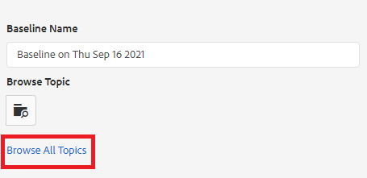

## Skapa en baslinje baserat på datum och tid

Du kan också skapa baslinjer som är en ögonblicksbild i tid.

1. Kontrollera att fliken Baslinjer är öppen och välj Skapa.

   

2. Under rubriken &quot;Ange version baserad på&quot; väljer du cirkeln &quot;Version On&quot;.

   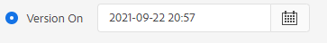

3. Välj kalenderikonen och ange datum och tid.

   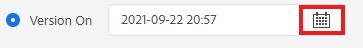

4. Ge baslinjen ett nytt namn om det behövs.

5. Välj **Spara**.

Baslinjen skapas. En tabell med alla ämnen och tillhörande information visas.

### Lägga till etiketter i baslinjen

Du kanske vill tilldela en ny etikett i grupp till allt kartinnehåll.

1. Välj den baslinje som du vill lägga till etiketter för.

2. Välj **Lägg till etiketter**.

   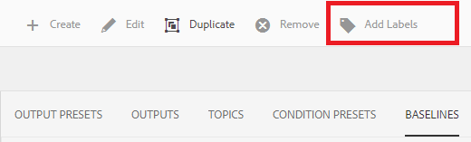

   Dialogrutan Lägg till etikett visas.

3. Ange den etikett som du vill tilldela och välj **Lägg till**.

Etiketten har lagts till i alla avsnitt.

## Generera AEM Site-utdata med en baslinje

1. Navigera till fliken Utdatainställningar på panelen Kartkontroll.

2. Markera kryssrutan AEM plats.

   

3. Välj **Redigera**.

   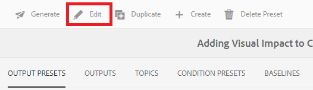

   En ny sida visas.

4. Markera kryssrutan Använd baslinje och välj den baslinje som du vill använda i listrutan.

   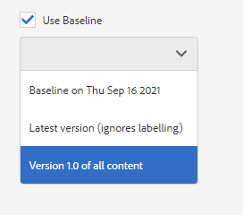

5. Välj **Klar**.

   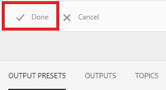

6. Välj **Generera**.

   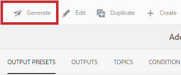

   Utdata har genererats med en baslinje.

## Visa genererade utdata

1. Navigera till fliken Utdata på kartkontrollpanelen.

2. Markera texten i kolumnen Generationsinställning för att öppna utdata.
   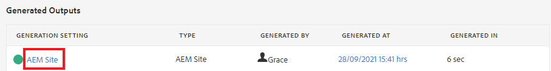

## Ta bort en baslinje

1. Markera den baslinje som du vill ta bort på fliken Baslinjer.

2. Välj **Ta bort**.

   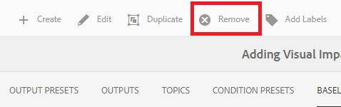

   Dialogrutan Ta bort baslinje visas.

3. Välj **Ta bort**.

Baslinjen tas bort.

## Duplicera en baslinje

1. Markera den baslinje som du vill duplicera på fliken Baslinjer.

2. Välj **Duplicera**.

   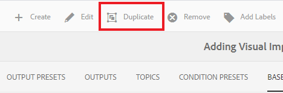

3. Välj **Spara**.

   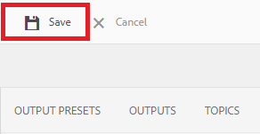

Den duplicerade baslinjen skapas.

## Ändra en baslinje

Du kan ange versionen av ett ämne som används i en baslinje direkt.

1. Markera den baslinje som du vill ändra på fliken Baslinjer.
2. Välj **Redigera**.

   

3. Välj **Bläddra bland alla ämnen**.

   

   En ämnestabell och tillhörande information visas.

4. För de ämnen du vill ändra väljer du önskad version i listrutan under kolumnen Version.

   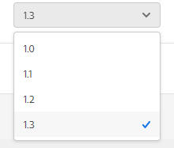

5. Välj **Spara**.

Ändringarna har sparats. Baslinjen kommer nu att använda de versioner av ämnet som du angav.

## Skapa en anpassad AEM för webbplatsutdata

Det är svårt att skilja mellan standardutdata av samma typ på fliken Utdata. Om du använder en anpassad förinställning för utdata med ett unikt och användarvänligt namn kan du åtgärda problemet.

I det här fallet skapar vi en förinställning baserad på en baslinje.

1. Navigera till fliken Utdatainställningar på panelen Kartkontroll.

2. Välj **Skapa**.

   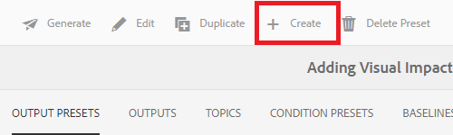

   En ny sida med förinställda utdata visas, som kallas Ny utdata.
3. Ange ett användarvänligt namn i fältet Inställningsnamn.

4. Markera kryssrutan Använd baslinje och välj önskad baslinje i listrutan.

   

5. Välj **Klar**.

Din nya förinställning har skapats och visas på sidan med förinställningar för utdata.
