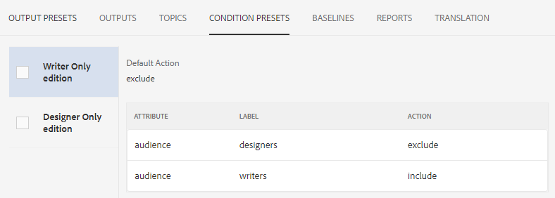
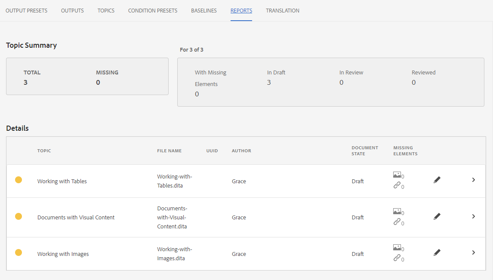

# Introduktion till Map Dashboard

Här följer en översikt över huvudfunktionerna i kartkontrollpanelen.

>[!VIDEO](https://video.tv.adobe.com/v/339040?quality=12&learn=on)

## Öppna en karta i kartkontrollpanelen

1. I databasvyn: välj ellipsikonen på kartan för att öppna Alternativ-menyn och sedan Öppna kartkontrollpanelen.
   

   Kartkontrollpanelen öppnas på en annan flik.

## Komponenter i kartkontrollpanelen

Kartkontrollpanelen innehåller ett antal flikar, bland annat förinställningar, utdataresultat, ämne som används, baslinjer och annat.

### Förinställningar för utdata

På fliken Utdatainställningar visas standardförinställningarna för olika typer av utdata: AEM Site, PDF, HTML 5, ePub och Custom.

Du kan välja en förinställning för utdata om du vill visa information om dess inställningar, inklusive omformningsnamn, målsökväg, baslinjer och använda villkor.

### Utdata

På fliken Utdata visas alla tidigare genererade utdata och de utdata som genereras.

En grön cirkel under kolumnen Genereringsinställningar anger att utdata har skapats. Texten i den här kolumnen fungerar som en aktiv hyperlänk, och du kan markera dem för att öppna de genererade utdata. Posterna under kolumnen Typ anger utdatatypen.
Här visas även annan information om generering av utdata, inklusive namnet på den användare som genererade utdata, datum och tid för genereringen samt den tid det tog för genereringen att ske. Om det uppstår ett fel under genereringen kan du välja datum och tid för genereringen i kolumnen Genererad vid för att öppna och granska felloggen.

### Ämnen

På fliken Ämnen visas en lista med alla ämnen på kartan.

Om du markerar kryssrutan för ett ämne kan du utföra ytterligare åtgärder. Du kan redigera den, återskapa den och visa, använda eller dölja dess taggar.

### Förinställningar för villkor

På fliken Villkorsförinställningar visas inställningarna för specifikt villkorat innehåll som ska inkluderas eller exkluderas.

Om du markerar kryssrutan för Endast skribent-utgåvan utesluts allt innehåll med attributet &quot;publik&quot; som har etiketten &quot;designers&quot; och allt innehåll med etiketten &quot;writers&quot;.

### Baslinjer

På fliken Baslinjer kan du visa dina baslinjer.

Baslinjer fungerar som ögonblicksbilder i tid och gör att du kan skapa en version av dina ämnen och resurser för publicering. En baslinje som till exempel hämtar innehåll vid ett visst datum och en viss tid kan använda version 1.3 av ett ämne och 1.0 av ett annat ämne, baserat på deras respektive versioner vid det tillfället.
Om ingen baslinje har angetts genereras utdata med de senaste versionerna av allt innehåll.

### Rapporter

På fliken Rapporter visas en sammanfattning av ämnesinformation, inklusive antalet ämnen som används, saknade element i dessa ämnen och dokumentstatus.

Om ett ämne saknar ett element kan du markera pilen längst till höger på raden för att expandera posten och visa information om felet.
