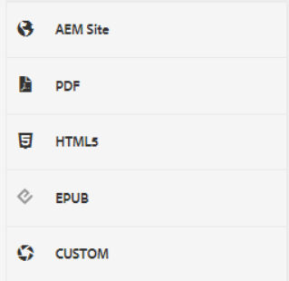
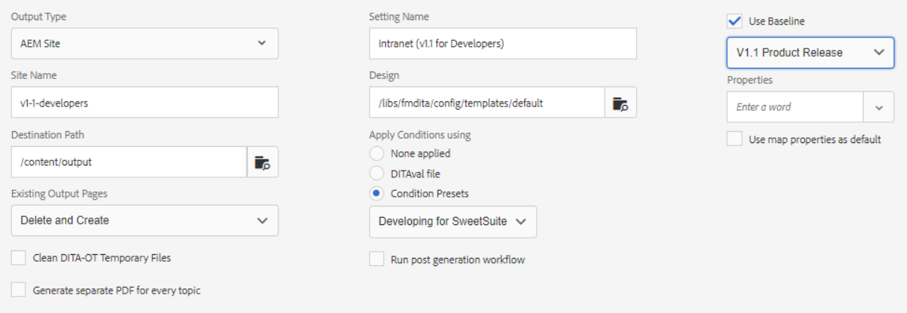

# Förinställningar för utdata

En förinställning för utdata är en samling publiceringsegenskaper som har tilldelats en karta. Dessa kan skapas eller ändras vid behov.

>[!VIDEO](https://video.tv.adobe.com/v/338989)

## Åtkomst till förinställningar för utdata

En förinställning för utdata visas när en karta i XML-redigeraren öppnas på kartkontrollpanelen. Förinställningarna kan innehålla information om en viss utdatatyp, målsökväg, anvisningar om hur du hanterar befintliga utdatasidor och andra inställningar som kan användas på en karta för att generera utdata.

## Skapa en förinställning för utdata

>[!NOTE]
>
>OBS! Vissa funktioner som används av en förinställning kan vara beroende av att du först utvecklar en baslinje eller en förinställning för villkor. Om det behövs måste du konfigurera dem på rätt flikar.

1. Välj en förinställning för baslinjeutdata. Du kan till exempel välja AEM eller PDF om den nya förinställningen som ska skapas är för en webbplats eller för att tillhandahålla Adobe PDF-innehåll.

2. Klicka **Skapa**.

3. Välj en utdatatyp om det behövs.

4. Baserat på utdatatypen kan du konfigurera alternativen ytterligare.

5. Klicka **Klar**.

## Redigera en förinställning

Utdataförinställningar är fördefinierade men kan anpassas efter behov.

1. Öppna kartkontrollpanelen.

2. Välj **Förinställningar för utdata** -fliken.

3. Välj en förinställning för utdata.

4. Klicka **Redigera**.

5. Ändra inställningarna efter behov.

   

6. Klicka **Klar**.
