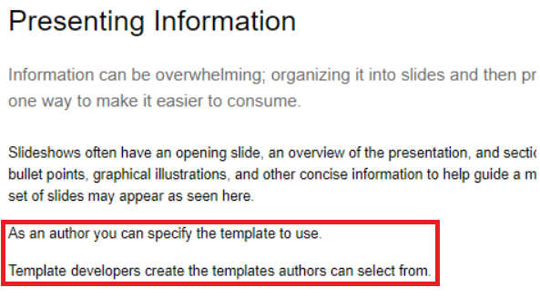
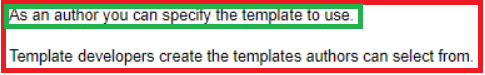
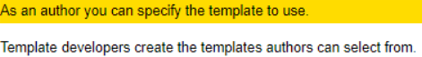
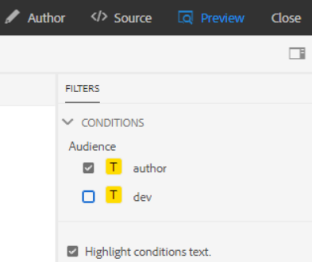
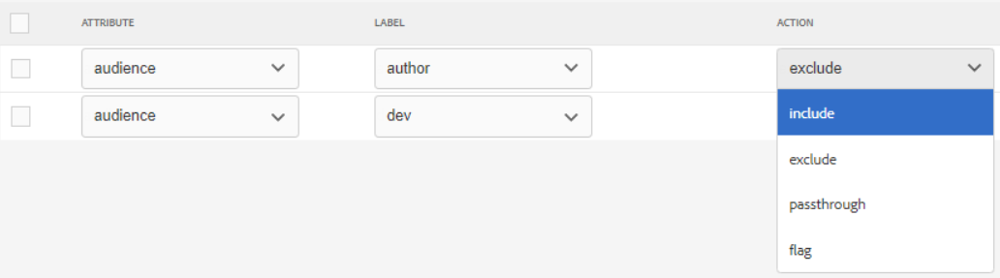
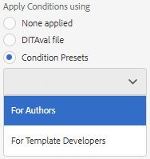
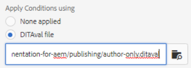

# Publicera med villkor

Med villkorlig publicering kan en innehållskälla skrivas för en eller flera målgrupper, produkter eller plattformar. Den här informationen kan sedan publiceras dynamiskt och endast det innehåll som krävs i utdata.

>[!VIDEO](https://video.tv.adobe.com/v/339041)

## Förberedelse för övningen

Du kan hämta exempelfiler för övningen här.

[Översikt - nedladdning](assets/exercises/publishing-with-conditions.zip)

## Markera innehåll med villkorsattribut

1. Öppna det ämne som ska ändras.

2. Ange den text som ska bli villkorlig. Ett eller flera stycken, en hel tabell, en illustration eller annat innehåll.

   

3. Markera det specifika innehåll som du vill tilldela ett villkorsattribut till. Ett enstaka stycke i källan.

   

4. I högra rullen ser du till att Egenskaper visas.

5. Lägg till ett attribut för målgrupp, produkt eller plattform.

6. Tilldela ett värde till attributet. Innehållet visas med uppdateringar för att visa villkorlig kod.

   

## Förhandsgranska villkorligt innehåll

1. Klicka **Förhandsgranska**.

2. Under **Filter** markerar eller avmarkerar du de villkor som ska visas eller döljas.

3. Markera eller avmarkera **Markera villkorstext**.

   

## Skapa en villkorsförinställning

En villkorsförinställning är en samling egenskaper som definierar vad som ska inkluderas, exkluderas, eller på annat sätt markeras, under genereringen av utdata.

1. På kartkontrollpanelen väljer du **Förinställningar för villkor** -fliken.

2. Klicka **Skapa**.

3. Välj **Lägg till** (eller **Lägg till alla**).

4. Ge villkoret ett namn.

5. Välj en kombination av attribut, etikett och åtgärd.

   

6. Upprepa efter behov.

7. Klicka **Spara**.

## Generera villkorliga utdata

När villkoren har tillämpats på innehållet kan de genereras som utdata. Detta kan antingen använda en villkorsförinställning eller en DITAval-fil.

## Generera villkorliga utdata med en villkorsförinställning

1. Välj **Förinställningar för utdata** -fliken.

2. Välj en förinställning för utdata.

3. Klicka **Redigera**.

4. Under **Använd villkor med** välj en villkorsförinställning.

   

5. Klicka **Klar**.

6. Generera förinställningen för utdata och granska innehållet.

## Generera villkorliga utdata med en DITAval-fil

DITAval-filen kan användas för att publicera villkorsstyrt innehåll. Detta kräver att en fil skapas eller överförs och sedan refereras vid publiceringen.

1. Välj **Förinställningar för utdata** -fliken.

2. Välj en förinställning för utdata.

3. Klicka **Redigera**.

4. Välj en DITAval-fil under Använd villkor med.

   

5. Klicka **Klar**.

6. Generera förinställningen för utdata och granska innehållet.
