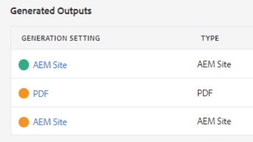
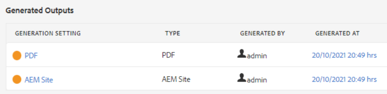
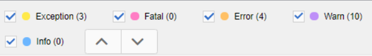

# Felsökning av publiceringsfel

Det är oftast enkelt att publicera en karta. Öppna kartan, välj en förinställning för utdata och generera utdata! Om en karta eller dess ämnen innehåller fel kan dock utdatagenereringen misslyckas. När detta inträffar är det viktigt att du vet hur du felsöker.

>[!VIDEO](https://video.tv.adobe.com/v/338990)

## Förberedelse för övningen

Du kan hämta exempelfiler för övningen här.

[Översikt - nedladdning](assets/exercises/publishing-basic-to-advanced.zip)

## Vanliga orsaker till publiceringsfel

Fel kan uppstå i källinnehållet. Till exempel:

* Felaktigt namngiven filsökvägsreferens

* Felaktigt namngiven mapp

* Grafik eller fil saknas

* Felaktigt konfigurerad innehållsreferens

* Bruten korsreferens

* Fel i värden för ett attribut (t.ex. en sträng i stället för ett tal)

* Felaktig installation av komponenter som används av [!DNL AEM Guides]

## Inverkan av fel

Ett fel kan vara mindre och resultera i en enkel anteckning som talar om för dig att en fil inte har paketerats korrekt, eller tillräckligt allvarlig så att den leder till ett fullständigt fel när utdata genereras. På fliken Utdata visas färgkodade ikoner för att visa om utdata har genererats eller inte.

## Öppna och granska felloggar

Loggfilen som genereras kan öppnas för granskning.

1. I **Utdata** klickar du på **datum/tid under Genererad den.**

   

2. Bläddra igenom felloggen.

## Visa och dölja feltyper

I felloggen visas varje feltyp i en unik färg.

1. **Välj** eller **avmarkera** feltyper för att visa eller dölja markeringar.

2. Navigera till fel med **nästa** eller **föregående** knappar (pilar).

## Åtgärda fel

Beroende på typen av fel kan upplösningen vara enkel eller komplex. Det kan utföras av en författare i XML-redigeraren eller kräva att administratören arbetar med [!DNL AEM Guides]. Specifika korrigeringar beror på felet, effekten och organisationens arbetsflöden.

* Felaktigt namngiven filsökvägsreferens

       Författare kan uppdatera sökvägsreferensen i källdokumentet.
       
   
* Felaktigt namngiven mapp

       Författare kan uppdatera mappnamnet eller flytta filer efter behov.
       
   
* Grafik eller fil saknas

       Författare kan överföra en bild/fil som saknas, byta namn på en bild/fil eller flytta en bild/fil
       
   
* Felaktigt konfigurerad innehållsreferens

       Författare kan korrigera platsen för det refererade innehållet eller ändra sökvägen till innehållsreferensen.
       
   
* Bruten korsreferens

       Författare kan korrigera platsen för korsreferenspunkterna eller ändra namnet eller egenskaperna för målfilen
       
   
* Fel i värden för ett attribut (t.ex. en sträng i stället för ett tal)

       Författare kan uppdatera attributet till ett korrekt värde eller så kan administratörer uppdatera systemet så att det stöder nya värden.
       
   
* Felaktig installation av komponenter som används av [!DNL AEM Guides]

       Administratörer kan uppdatera installationen av systemet, dess komponenter eller behörigheter.
       
   