# Arbeta med rapporter

På fliken Rapporter på panelen Kartkontroll kan du identifiera och åtgärda brutna länkar, innehåll som refereras och återanvänds (conrefs), korsreferenser eller annan saknad information.

>[!VIDEO](https://video.tv.adobe.com/v/339039)

## Förberedelse för övningen

Du kan hämta exempelfiler för övningen här.

[Översikt - nedladdning](assets/exercises/working-with-reports.zip)

## Överför resurser

1. I Databasvyn: välj ellipsikonen i huvudmappen för att öppna Alternativ-menyn.

   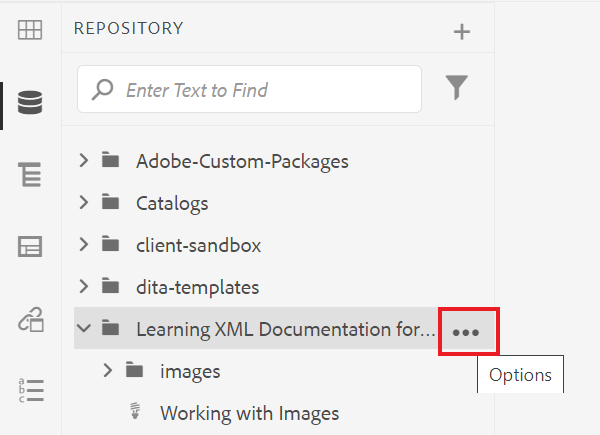

2. Välj **[!UICONTROL Upload Assets]**.

   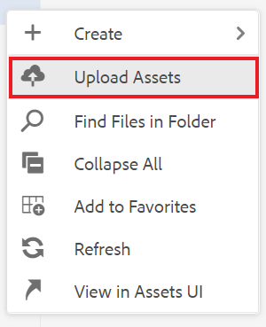

3. Markera de filer som du vill överföra till mappen och välj **Överför**.

DITA-filerna öppnas och du bör granska dem för att se om det finns problem med saknat innehåll, referenser eller korsreferenser.

## Skapa en karta

1. Välj ellipsikonen i huvudmappen för att öppna Alternativ-menyn.

   

2. Välj **Skapa > Karta**.

   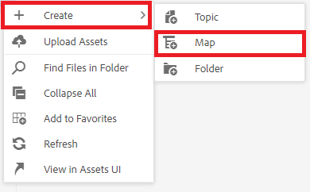

   Dialogrutan Skapa ny karta visas.

3. Välj **Bookmap** (eller **Karta** baserat på innehållstypen som du skapar) i listrutan och ge kartan en titel.

4. Välj **Skapa**.

Kartan skapas och den vänstra listen ändras automatiskt från databasvyn till kartvyn.

## Infoga kartkomponenter

1. Välj pennikonen i den vänstra listen.
Det här är redigeringsikonen och du kan öppna kartan i redigeraren.

   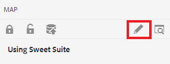

2. Växla tillbaka till databasvyn genom att välja ikonen Databas.

   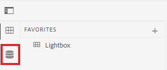

3. Lägg till ett ämne på kartan genom att dra och släppa det från databasen till kartan i redigeraren.
Radindikatorn visar var ämnet placeras.

4. Fortsätt lägga till ämnen efter behov.

5. När du är klar väljer du **Spara som ny version.**

   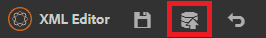

6. I *Kommentarer till den nya versionen* anger du en beskrivande kommentar.

7. Välj **Spara**.

## Generera AEM

1. I databasen väljer du ellipsikonen på kartan för att öppna Alternativ-menyn och sedan **Öppna kartkontrollpanelen.**

   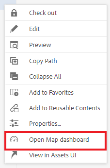

   Kartkontrollpanelen öppnas på en annan flik.
2. Välj **AEM**.

   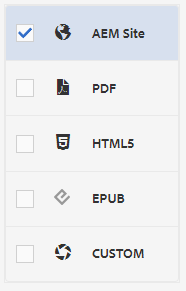

3. Välj **Generera**.

4. Navigera till sidan Utdata för att visa status för dina genererade utdata.
Om fel uppstår kan en orange cirkel visas i kolumnen Generationsinställning i stället för grön på fliken Utdata, vilket anger att genereringen är klar.

5. Markera länken under kolumnen Generationsinställning för att öppna de genererade utdata.
Granska utdata för innehåll som saknas.

## Fliken Rapporter

På fliken Rapporter visas en ämnessammanfattning och en tabell med ämnesinformation och problemen på kartan.

Det bästa är att du alltid kontrollerar rapporter för en karta efter att du har importerat innehållet.

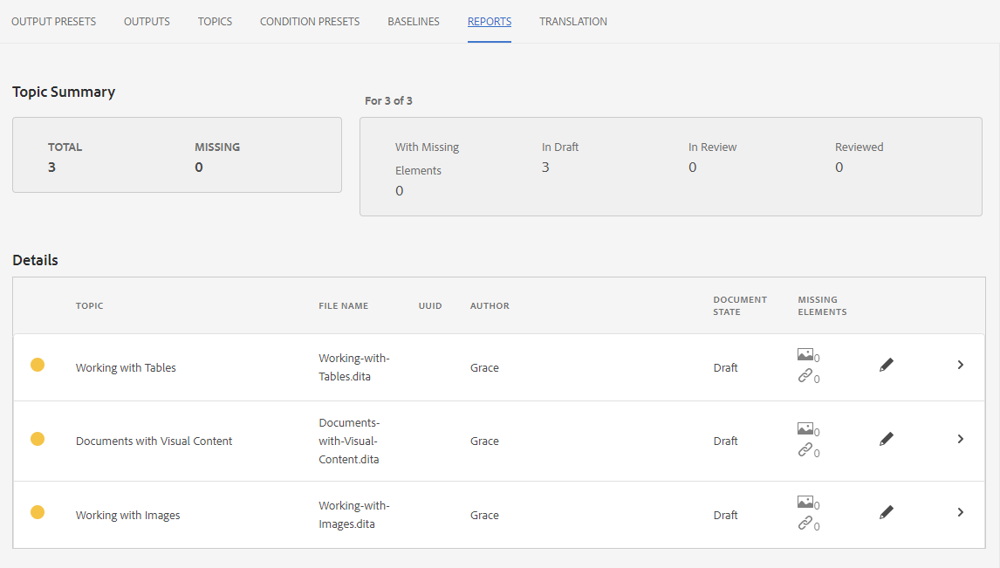

Kolumnen Saknade element anger antalet saknade bilder och brutna konturer. Du kan välja **Penna** om du vill öppna ämnet i redigeraren.

## Lösa saknade bilder

Om bilder saknas i filerna kan det bero på att innehållet har överförts, men att bilderna inte har det. I så fall löser du problemet med saknade bilder genom att överföra bilder till en viss mapp som matchar sökvägen och filnamnen som filerna förväntar sig.

1. I *Databasvy* väljer du ikonen Ellips i mappen med bilder för att öppna Alternativ-menyn.

   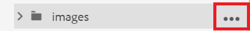

2. Välj **[!UICONTROL Upload Assets]** och markera de saknade bilderna.

3. Välj **Överför**.

De saknade bilderna har överförts. Nu visas de här bilderna i en ny genererad AEM, och inga bildfel visas på fliken Rapporter.

## Löser brutna konrefar

Om innehåll som refereras någon annanstans (en conref) länkar till en fil i en annan mapp (till exempel en som heter &quot;reuse&quot;). och innehållet inte har överförts måste ett fel åtgärdas. Du måste till exempel skapa en undermapp med namnet&quot;återanvänd&quot; och överföra den saknade filen till&quot;återanvänd&quot;.

### Överföra en resurs med [!UICONTROL Assets] UI

Förutom [!UICONTROL Upload Assets] kan du överföra resurser genom att dra och släppa dem i resursgränssnittet.

1. I Databasvyn: välj ellipsikonen i mappen för återanvändning för att öppna Alternativ-menyn.

   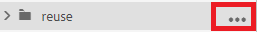

2. Välj **Visa i resursgränssnitt**.

   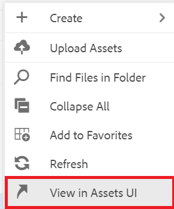

3. Dra och släpp filen i mappen.
Filen överförs och conref-felet åtgärdas.

Alla fel har nu åtgärdats. Rapportsidan anger att det inte finns fler fel och när du genererar en AEM resulterar detta i en fullständig utskrift utan att några komponenter saknas.
