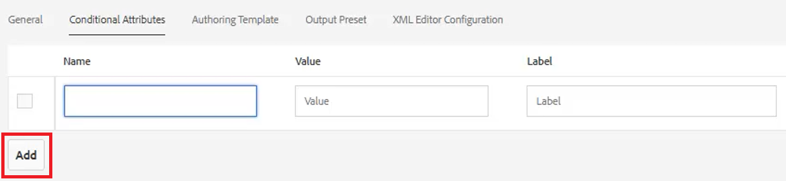
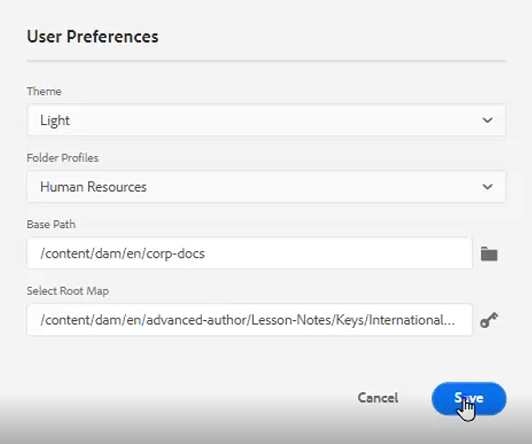
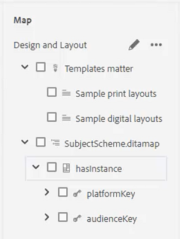
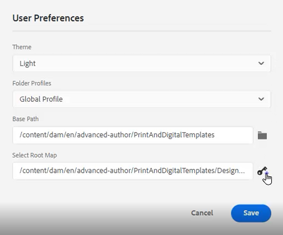

# Villkor

I DITA styrs villkoren ofta av attribut som Product, Platform och Audience. Dessa kan också ha specifika värden tilldelade. Användarna kan styra allt detta via Mappprofiler.

Exempelfiler som du kan välja att använda för den här lektionen finns i filen [villkor.zip](assets/conditions.zip).

>[!VIDEO](https://video.tv.adobe.com/v/342755?quality=12&learn=on)

## Tilldela villkor till en mappprofil

1. Välj **Mappprofiler** platta.

1. Klicka [!UICONTROL **Villkorliga attribut**].

1. Klicka [!UICONTROL **Redigera**] i profilens övre vänstra hörn.

1. Klicka [!UICONTROL **Lägg till**].

   

1. Fyll i de obligatoriska fälten.

   - Namnet ska motsvara ett attribut som används för profilering.

   - Värdet är den exakta posten som kommer att användas i DITA-kodkällan.

   - Etiketten är det ord som visas av användaren som anger attribut.

1. Klicka [!UICONTROL **Spara**].

>[!NOTE]
>
>OBS! Att konfigurera en global profil kan vara ett tidigt och effektivt sätt att styra användningen av attribut och värden för att följa en konsekvent formatguide.

## Tilldela attribut till element

Om ingen anpassad mappprofil har tilldelats ett koncept kan du tilldela attribut till specifika element, t.ex. stycken.

1. Från **Databasvy** klickar du på elementet som du vill arbeta med för att markera det.

1. I **Innehållsegenskaper** klickar du på [!UICONTROL **Attribut**] listruta.

1. Välj det attribut du vill tilldela.

1. Lägg till en **Värde**.

Kopplingen attribut och värde tilldelas nu till det valda elementet.

## Tilldela attribut- och värdepar med villkor

På villkorspanelen kan du styra tilldelningen av attribut- och värdepar.

1. Ändra **Användarinställningar**.

   a. Klicka på ikonen Användarinställningar.

   

   b. Fyll i de obligatoriska fälten i **Användarinställningar** -dialogrutan. Till exempel:

   

   c. Klicka [!UICONTROL **Spara**].

1. Expandera listrutorna för Audience och Platform från villkorspanelen. Observera att de tillgängliga villkoren är mappprofilspecifika.

1. Dra och släpp ett villkor till önskat element för att tilldela det.

## Tilldela ett ämnesschema

Ämnesscheman är en specialiserad form av diamap och refereras av en karta. Ämnesscheman används för att definiera taxonomier. De ger kontroll över tillgängliga värden.

1. Navigera till **Databasvy**.

1. Välj en karta som refererar till objektschemat. I det här exemplet används kartan som anropas _Design och layout_.

   

1. Konfigurera användarinställningar.

   a. Klicka på [!UICONTROL **Användarinställningar**] ikon.

   

   b. Fyll i fälten i **Användarinställningar** -dialogrutan.

   c. Klicka på mappsymbolen bredvid fältet Bassökväg för att välja sökvägen till önskad fil.

   d. Klicka [!UICONTROL **Välj**].

   e. Klicka på tangentsymbolen bredvid **Rotschema** fält för att ange en sökväg.

   >[!IMPORTANT]
   >
   >Viktigt: Den valda rotkartan måste vara den karta som innehåller ämnesschemat.

   

   f. Begränsa de visade resurserna genom att markera den eller de mappar som du vill använda.

   g. Klicka [!UICONTROL **Välj**].

   h. Klicka [!UICONTROL **Spara**].

Ämnesschemat har nu tilldelats.

## Visa ämnesschemat från villkorspanelen

1. Navigera till **Inställningar för Redigeraren**.

1. Välj **Villkor** -fliken.

1. Markera rutan **Visa ämnesschema på panelen Villkor**
