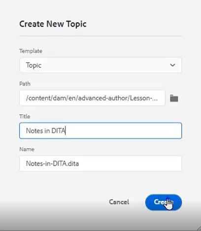
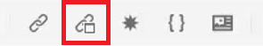
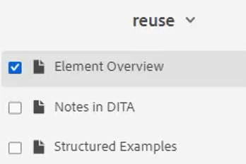
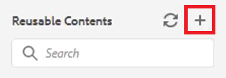

# Återanvändning av innehåll

En av huvudfunktionerna i DITA är möjligheten att återanvända innehåll. Det gör det möjligt att återanvända innehåll från små fraser upp till hela ämnen eller kartor.  Men för att innehållet ska kunna återanvändas på ett effektivt sätt måste det hanteras väl. Se till att ni har en effektiv innehållsstrategi när ni arbetar med återanvändbar information.

>[!VIDEO](https://video.tv.adobe.com/v/342757?quality=12&learn=on)

## Skapa ett återanvändbart ämne

När en ändring görs i ett återanvändbart källämne uppdateras informationen överallt där innehållet används.

1. Navigera till **Databas**.

2. Klicka på **snabbmeny** bredvid mappen för återanvändning.

3. Välj **Skapa > Dita-ämne**.

4. Fyll i fälten i dialogrutan Skapa nytt ämne. Till exempel:

   

5. Klicka [!UICONTROL **Skapa**].

6. Lägg till innehåll i ämnet efter behov.

## Lägga till ett nytt återanvändbart element i ett ämne

Det finns flera metoder för att lägga till återanvändbara element. Här är det första arbetsflödet bäst när du bara lägger till en komponent. Det andra arbetsflödet är bättre om du vill lägga till flera återanvändbara komponenter.

### Arbetsflöde 1

1. Klicka på ämnet på en giltig plats.

2. Välj **Infoga återanvändbart innehåll** ikonen i det övre verktygsfältet.

   

3. I dialogrutan Återanvänd innehåll klickar du på [!UICONTROL **Mapp**] ikon.

4. Navigera till önskad mapp.

5. Välj ett ämne med återanvändbara komponenter.
Till exempel:

   

6. Klicka [!UICONTROL **Välj**].

7. Välj en specifik komponent som ska återanvändas.

8. Klicka [!UICONTROL **Välj**].

Det återanvändbara elementet har nu infogats i avsnittet.

### Arbetsflöde 2

1. Navigera till **Återanvändbart innehåll** till vänster.

2. Klicka på [!UICONTROL **Lägg till**] på panelen Återanvändbart innehåll.

   

3. Navigera till en mapp.

4. Välj ett eller flera specifika ämnen.

5. Klicka [!UICONTROL **Lägg till**].

6. Expandera från panelen Återanvändbart innehåll **Elementöversikt**.

7. Dra och släpp ett element i ämnet på en giltig plats.

Det återanvändbara elementet har nu infogats i avsnittet.

## Tilldela ett ID och värde till ett element

Den post du just skapade är ett återanvändbart element. Därför krävs ett ID och ett värde.

1. Klicka inuti posten.

2. Klicka på listrutan under Attribut i panelen Innehållsegenskaper.

3. Välj **ID**.

4. Ange ett logiskt namn för värdet.

5. Spara eller versionshantera ämnet så att ändringen återspeglas i databasen.

ID:t och värdet har tilldelats elementet.
