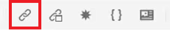
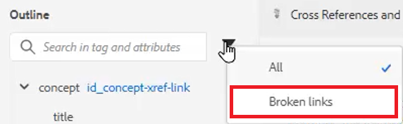

# Korsreferenser och länkar

XML-redigeraren och DITA är ett kraftfullt sätt att länka mellan ämnen. Det är viktigt att du effektivt hanterar dina innehållsreferenser, och det innefattar att arbeta med unika ID-värden.

Exempelfiler som du kan välja att använda för den här lektionen finns i filen
[crossreferencesandlinks.zip](assets/crossreferencesandlinks.zip)

>[!VIDEO](https://video.tv.adobe.com/v/342764?quality=12&learn=on)

## Skapa en korsreferens till ett externt ämne

Du kan skapa en extern korsreferens genom att dra och släppa ett ämne från databasen till en öppen fil. För att undvika brutna korsreferenser måste dock ett ID först definieras till ett värde som är relaterat till det överordnade elementet. Detta är ett enkelt sätt att skapa en korsreferens samtidigt som ID:n tilldelas korrekt.

1. Öppna en fil där du vill infoga en extern korsreferens.

2. Tilldela ett ID till elementet som ska refereras.

   a. Klicka inuti elementet.

   b. På panelen Innehållsegenskaper väljer du **ID** i listrutan Attribut.

   c. Skriv ett logiskt namn i fältet Värde.

   d. Visa elementet och dess värde i **Dispositionsvy** vid behov.

3. **Spara** ämnet som kontrollerar att databasen har det uppdaterade ID:t.

4. Klicka på [!UICONTROL **Referens**] ikonen i det övre verktygsfältet.

   

5. Från **Innehållsreferens** markerar du det ID och elementpar som du vill infoga som en korsreferens.

6. Klicka [!UICONTROL **Välj**].

Korsreferensen har lagts till i ämnet.

## Länka till en webbplats

Du kan infoga en länk till en webbplats inom vilket ämne som helst. Se videon AEM Guides Course 1 om länkning till webbplatser för mer information.

## Visa brutna länkar

Vissa ändringar kan leda till brutna korsreferenser. Detta kan vara att ta bort ett ämne, ordna om ett avsnitt som innehåller en korsreferens eller ändra ett ID efter att korsreferensen har infogats. Observera att ett exempelavsnitt _crossreferencesandlinks.zip_ finns i den här lektionen som gör att flera av punktkorsreferenserna till det interna innehållet bryts.

1. Navigera till **Dispositionsvy** till vänster.

2. Klicka på [!UICONTROL **Filter**] ikon.

3. Välj **Brutna länkar**.

   

Brutna länkar visas som klickbara objekt. Du kan identifiera dem i röd text i ämnet.
