# Konfiguration av XML-redigerare

Om du arbetar i en restriktiv miljö kan du välja vilka funktioner författarna kan se genom att anpassa redigerarkonfigurationen i en viss mappprofil. Om du använder den här mappprofilen kan du ändra utseendet på själva redigeraren, CSS-mallarna, tillgängliga fragment och etiketterna för innehållsversionen.

Exempelfiler som du kan välja att använda för den här lektionen finns i filen [xmleditorconfiguration.zip](assets/xmleditorconfiguration.zip).

>[!VIDEO](https://video.tv.adobe.com/v/342762)

## Anpassa standardkonfigurationen för redigeringsgränssnittet

Du kan alltid hämta standardgränssnittskonfigurationen till din lokala dator, göra ändringar i den i valfri textredigerare och sedan överföra den igen.

1. På navigeringsskärmen klickar du på [!UICONTROL **verktyg**] ikon.

   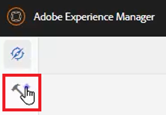

2. Välj **Stödlinjer** till vänster.

3. Klicka på [!UICONTROL **Mappprofiler**] platta.

   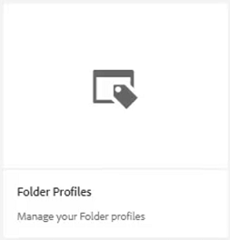

4. Välj en mappprofil.

5. Klicka på [!UICONTROL **Konfiguration av XML-redigerare**] -fliken.

6. Klicka [!UICONTROL **Hämta**] Standard.

   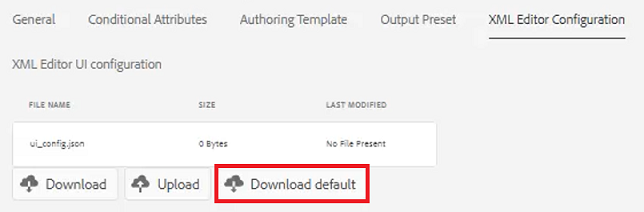

Du kan nu öppna och ändra innehållet i en textredigerare. The _Installation och konfiguration av AEM_ Handboken innehåller exempel på hur du tar bort, anpassar eller lägger till funktioner i gränssnittskonfigurationen.

## Överför den ändrade gränssnittskonfigurationen för XML-redigeraren

När du har anpassat gränssnittskonfigurationen kan du överföra den. Observera att en exempelkonfigurationsfil _ui-config-restricted-editor.json_ innehåller en uppsättning ämnen som kan användas i lektionen.

1. Klicka på knappen [!UICONTROL **Konfiguration av XML-redigerare**] -fliken.

2. Under gränssnittskonfigurationen för XML-redigeraren klickar du på [!UICONTROL **Överför**].

   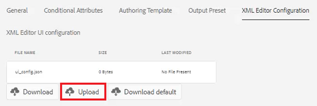

3. Dubbelklicka på filen för den ändrade användargränssnittskonfigurationen, eller så som visas här, den medföljande exempelfilen.

   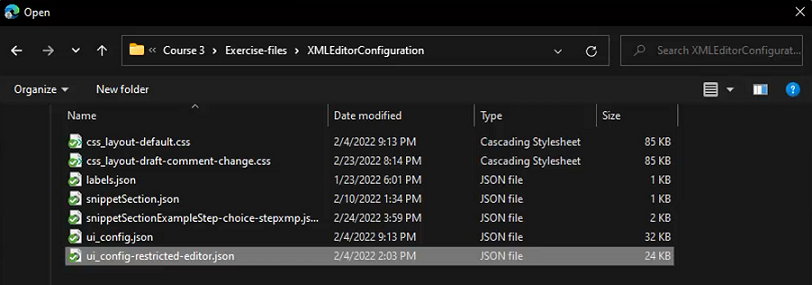

4. Klicka [!UICONTROL **Spara**] i skärmens övre vänstra hörn.

Den ändrade gränssnittskonfigurationen har överförts.

## Anpassa CSS-mallayouten

Precis som med gränssnittskonfigurationen kan du hämta CSS-mallayouten. Du kan öppna det i en textredigerare och göra ändringar för att anpassa utseendet på ämnet innan du överför det.

1. På navigeringsskärmen klickar du på [!UICONTROL **verktyg**] ikon.

   

2. Välj **Stödlinjer** till vänster.

3. Klicka på [!UICONTROL **Mappprofiler**] platta.

   

4. Välj en mappprofil.

5. Klicka på [!UICONTROL **Konfiguration av XML-redigerare**] -fliken.

6. Under CSS-mallayout klickar du på [!UICONTROL **Hämta**].

   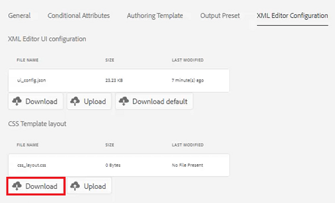

Nu kan du ändra och spara CSS-innehållet i en textredigerare.

## Överför den ändrade CSS-mallayouten

När du har anpassat CSS-mallayouten kan du överföra den. Observera att en exempelfil _css-layout-ONLY-draft-comment-change.css_ innehåller en uppsättning ämnen som kan användas i lektionen. Den här filen innehåller bara utkastet till kommentarsändring, medan _css-layout-draft-comment-change.css_ är hela filen som du bara kan använda för testning eller granskning.

1. Klicka på knappen [!UICONTROL **Konfiguration av XML-redigerare**] -fliken.

2. Under CSS-mallayout klickar du på [!UICONTROL **Överför**].

   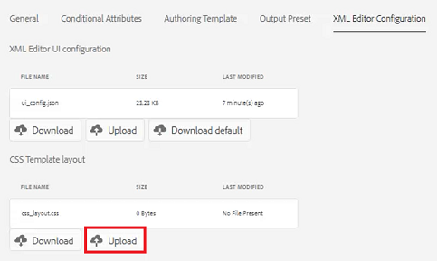

3. Dubbelklicka på filen för din egen anpassade CSS-layout eller den exempelfil som visas här.

   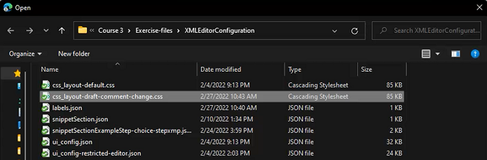

4. Klicka [!UICONTROL **Spara**] i skärmens övre vänstra hörn.
Du har överfört den anpassade CSS-mallayouten.

## Redigera XML-redigerarkodfragment

Kodavsnitt är återanvändbara innehållsdelar som kan vara specifika för en produkt eller grupp. Observera att exempelfragmenten finns med i supportfilerna för den här lektionen.

1. På navigeringsskärmen klickar du på [!UICONTROL **verktyg**] ikon.

   

2. Välj **Stödlinjer** till vänster.

3. Klicka på [!UICONTROL **Mappprofiler**] platta.

   

4. Välj en mappprofil.

5. Klicka på [!UICONTROL **Konfiguration av XML-redigerare**] -fliken.

6. Klicka på under XML-redigerarfragment **Överför**.

   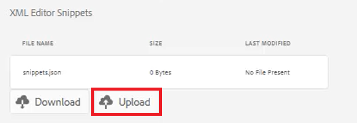

7. Välj egna fragment eller använd de medföljande exemplen.

   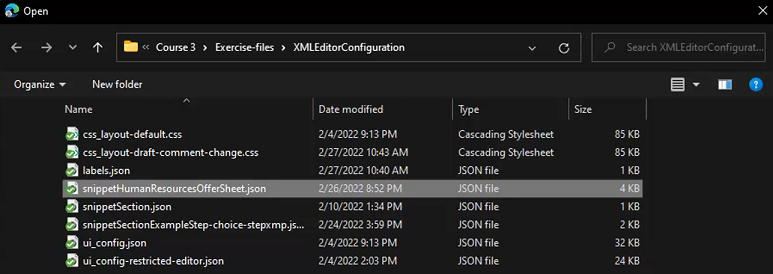

8. Klicka [!UICONTROL **Spara**] i skärmens övre vänstra hörn.

Du har lagt till nya fragment i redigeraren.

## Anpassa versionsetiketter för XML-innehåll

Som standard kan författare skapa egna etiketter och associera dem med ämnesfiler. Detta kan leda till olika variationer på samma etikett. För att undvika inkonsekventa etiketter kan du även välja i listor med fördefinierade etiketter.

1. På navigeringsskärmen klickar du på [!UICONTROL **verktyg**] ikon.

   

2. Välj **Stödlinjer** till vänster.

3. Klicka på [!UICONTROL **Mappprofiler**] platta.

   

4. Välj en mappprofil.

5. Klicka på [!UICONTROL **Konfiguration av XML-redigerare**] -fliken.

6. Klicka på under Versionsetiketter för XML-innehåll [!UICONTROL **Hämta**].

   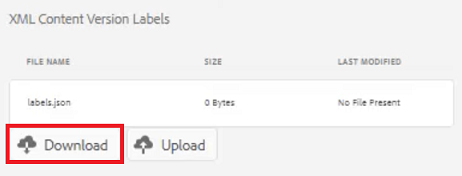

Nu kan du anpassa etiketterna efter behov.

## Överför versionsetiketter för XML-innehåll

När du har laddat ned och ändrat etiketterna kan du ladda upp avsnittet XML Content Version Label. Du kan välja att använda exempelfilen _labels.json_, som innehåller en uppsättning ämnen som kan användas i lektionen.

1. Klicka på knappen [!UICONTROL **Konfiguration av XML-redigerare**] -fliken.

2. Klicka på under Versionsetiketter för XML-innehåll [!UICONTROL **Överför**].

   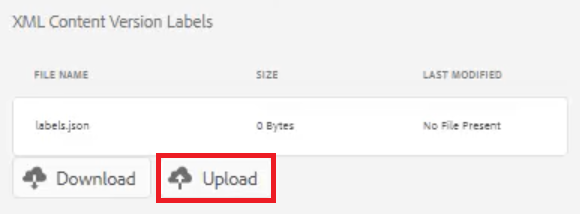

3. Dubbelklicka på filen för antingen egna etiketter eller exempelfilen som visas här.

   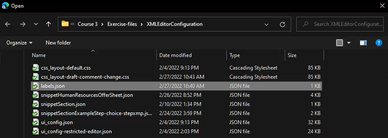

4. Klicka [!UICONTROL **Spara**] i skärmens övre vänstra hörn.

Du har överfört anpassade versionsetiketter för XML-innehåll.
