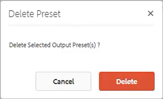

# Mappprofiler

AEM ger snabb åtkomst till konfigurationsverktygen. Genom att anpassa mappprofiler kan olika avdelningar eller produkter ha unika mallar, redigeringsmiljöer, villkorsstyrda attributprofiler, kodfragment eller till och med Web Editor-konfigurationer.

Exempelfiler som du kan välja att använda för den här lektionen finns i filen [folderprofiles.zip](assets/folderprofiles.zip).

>[!VIDEO](https://video.tv.adobe.com/v/342758?quality=12&learn=on)

## Åtkomst till mappprofiler

Konfigurationer hanteras med hjälp av ikonen Mappprofiler.

1. På navigeringsskärmen klickar du på [!UICONTROL **verktyg**] ikon.

   

2. Välj **Stödlinjer** till vänster.

3. Klicka på [!UICONTROL **Mappprofiler**] platta.

   

4. Välj önskad profil. Välj till exempel **Global profil**, som är standardprofilen.

   

## Redigera villkorsattribut i den globala profilen

När du har öppnat den globala profilen kan du redigera dess konfiguration. Inställningarna för global profil tillämpas på alla användare om inget annat anges.

1. I den globala profilen väljer du **Villkorliga attribut** -fliken.

2. Klicka [!UICONTROL **Redigera**] i skärmens övre vänstra hörn.

   

3. Klicka [!UICONTROL **Lägg till**].

4. Fyll i **Namn**, **Värde** och **Etikett** fält för det nya villkoret.

   

5. Klicka [!UICONTROL **Spara**] längst upp till vänster på skärmen.
Det nya villkoret är nu tillgängligt för alla användare. Du kan markera den på panelen Innehållsegenskaper och tillämpa den på innehåll efter behov.

## Skapa en ny mappprofil

Förutom den globala standardprofilen kan du skapa egna anpassade profiler.

1. På navigeringsskärmen klickar du på [!UICONTROL **verktyg**] ikon.

   

2. Välj **Stödlinjer** till vänster.

3. Klicka på [!UICONTROL **Mappprofiler**] platta.

   

4. Klicka [!UICONTROL **Skapa**].

5. Dialogrutan Skapa mappprofil visas.

   a. Namnge profilen.

   b. Ange en sökväg.

   c. Klicka [!UICONTROL **Skapa**].

   

En ruta med det nya profilnamnet visas på sidan Mappprofiler.

## Lägga till administrativa användare från fliken Allmänt

Administrativa användare har behörighet att uppdatera villkorsattribut, redigeringsmallar och utdatainställningar för mappprofilen.

1. Klicka på rutan för att öppna den önskade mappprofilen.

   

2. Välj **Allmänt** -fliken.

3. Klicka [!UICONTROL **Redigera**] längst upp till vänster på skärmen.

4. Under Administratörsanvändare väljer du en användare i listrutan eller skriver ett användarnamn.

5. Klicka [!UICONTROL **Lägg till**].

   Du kan lägga till flera administratörsanvändare om det behövs.

   

6. Klicka [!UICONTROL **Spara**] i skärmens övre högra hörn när alla användare har lagts till.

Administrativa användare har nu tilldelats den här profilen.

## Lägg till en ny målgrupp på fliken Villkorsattribut

När du har öppnat den globala profilen kan du redigera dess konfiguration. Inställningarna för global profil tillämpas på alla användare om inget annat anges.

1. I den önskade mappprofilen väljer du **Villkorliga attribut** -fliken.

2. Klicka [!UICONTROL **Redigera**] i skärmens övre vänstra hörn.

   

3. Klicka [!UICONTROL **Lägg till**].

4. Fyll i **Namn**, **Värde** och **Etikett** fält för det nya villkoret.

   Klicka på [!UICONTROL **Plus**] kan du lägga till ytterligare Value- och Label-par för det namngivna attributet.

   

5. Klicka [!UICONTROL **Spara**] längst upp till vänster på skärmen.

De nya villkorsattributen har lagts till i den här profilen.

## Välj en mall och en karta på fliken Redigeringsmallar

AEM Guides innehåller färdiga mallar och kartor. Du kan begränsa dem till vissa författare. Som standard lagras mallarna på resursplatsen i en DITA-mallmapp.

1. Välj fliken Redigeringsmallar i den önskade mappprofilen.

2. Klicka på Redigera i skärmens övre vänstra hörn.

3. Lägg till en kartmall.

   a. Från **Kartmallar** väljer du ett av de tillgängliga kartorna.

   b. Klicka [!UICONTROL **Lägg till**].

   

4. Lägg till en ämnesmall.

   a. Från **Ämnesmallar** väljer du ett alternativ bland de tillgängliga mallarna.

   

5. Klicka [!UICONTROL **Lägg till**].

6. Lägg till ytterligare ämnesmallar efter behov.

7. När du är klar klickar du på [!UICONTROL **Spara**] längst upp till vänster på skärmen.

De nya redigeringsmallarna har lagts till i den här profilen.

## Ta bort förinställningar som inte är nödvändiga på fliken Utdatförinställningar

Du kan konfigurera varje förinställning för utdata baserat på mappprofilen. Utdatainställningar som inte behövs bör tas bort.

1. I den önskade mappprofilen väljer du **Förinställningar för utdata** -fliken.

2. Markera kryssrutorna för de förinställningar som inte är obligatoriska på den vänstra panelen.

   

3. Klicka [!UICONTROL **Ta bort förinställning**] i skärmens övre vänstra hörn.

4. I dialogrutan Ta bort förinställning klickar du på [!UICONTROL **Ta bort**].

   

Nu är de enda utdataförinställningarna som visas de som kommer att användas.

## Överföra ett fragment från fliken Konfiguration i XML-redigeraren

1. I den önskade mappprofilen väljer du **Konfiguration av XML-redigerare** -fliken.

2. Klicka på under XML-redigerarfragment [!UICONTROL **Överför**].

   

3. Navigera till ett tidigare skapat kodfragment.

4. Klicka [!UICONTROL **Öppna**].

5. Klicka [!UICONTROL **Spara**] längst upp till vänster på skärmen.

Du har ändrat redigeringskonfigurationen så att den innehåller kodfragment.

## Ange mappprofilen i databasen

I redigeraren ser du resultatet av de ändringar du har gjort i mappprofilerna.

1. Navigera till **Databasvy**.

2. Klicka på mappen för det innehåll du vill arbeta med.

3. Klicka på [!UICONTROL **Användarinställningar**] ikonen i det övre verktygsfältet.

   

4. Välj önskad mappprofil i listrutan i dialogrutan Användarinställningar.

   

5. Klicka [!UICONTROL **Spara**].

Du har använt mappprofilen på ditt innehåll. När du skapar ett nytt DITA-avsnitt visas nu en begränsad lista med ämnestyper som baseras på mappprofilen. Målgruppsvillkoret innehåller de globala inställningarna samt de som är specifika för mappprofilen. I fragmentfilen som du överförde skapades en uppsättning med standardfragment att välja bland. På kartkontrollpanelen visas de begränsade utdataförinställningarna.
