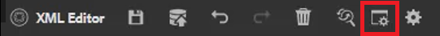

# Ordlista

På ordlistepanelen kan en karta tolkas. Du kan skapa en ordlisteämnesfil och inkludera den i en gemensam ordlista. Den här kartan kan sedan läggas till i andra kartor. Om du använder ordlistan blir det enklare att använda samma frasinformation och läsaren får bättre klarhet.

Exempelfiler som du kan välja att använda för den här lektionen finns i filen [ordlista.zip](assets/glossary.zip).

>[!VIDEO](https://video.tv.adobe.com/v/342765)

## Lägga till en ordlistepost i ett ämne

1. Navigera till **Ordlista** -panelen.

2. Dra och släpp posten från **Ordlista** till önskad plats i avsnittet.

Om kartan innehåller ordlisteposter och är korrekt konfigurerad kan ämnen uppdateras automatiskt så att de innehåller förkortade formulär.

## Ange en rotkarta

Du måste välja rätt rotkarta för att kunna arbeta med en ordlista. När en rotkarta hittar ordlisteposter visas de på ordlistepanelen.

1. Välj **Ordlista** från den vänstra panelen.

2. Klicka på [!UICONTROL **Användarinställningar**] ikonen i det övre verktygsfältet.

   

3. Klicka på nyckelikonen för att ange rätt rotkarta för att arbeta med ordlistan.

4. Klicka [!UICONTROL **Välj**].

5. Klicka [!UICONTROL **Spara**].

Ordlistepanelen uppdateras automatiskt.

## Arbeta med ordlistan

1. Navigera till **Databasvy**.

2. Markera kartan som har förkonfigurerats för att fungera med ordlistan.

   

3. Välj [!UICONTROL **Kartvy**].

4. Kontrollera att schemavy visar de ämnen som krävs.

## Förhandsgranska en ordlista

Eftersom det går att göra stora ändringar kan det vara viktigt att förhandsgranska en ordlista.

1. Välj **Ordlista** från den vänstra panelen.

2. Klicka på snabbmenyn bredvid en ordlista och välj [!UICONTROL **Förhandsgranska**].

Både den förkortade formen och den ordlistedefinition visas.

## Granska inställningar för verktyget Aktiv punkt

Använd verktyget Aktiveringspunkt för att skapa en hel samling ordlisteposter från en enda karta. Du kan till och med söka efter och konvertera specifika textermer till länkade ordlisteförkortningar.

1. På ordlistepanelen väljer du [!UICONTROL **Ikon för aktiveringspunkt**].

   

2. Klicka på [!UICONTROL **Ordlistenycklar**] och välj bara de tangenter som du vill använda.

3. Klicka på [!UICONTROL **Ämnen**] för att välja vilket innehåll som ska påverkas.

4. Klicka på [!UICONTROL **Filtrera ämnen efter status**] listruta för att granska konfigurerade alternativ.

5. Konfigurera de återstående inställningarna efter behov.

6. När du är klar klickar du på [!UICONTROL **Konvertera**].

I ordlistepanelen visas nu alla uppdaterade ämnen och även ämnen med fel.
