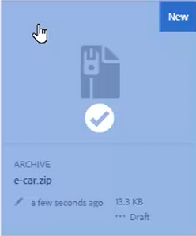
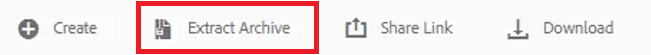
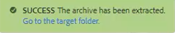
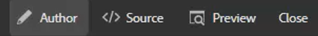
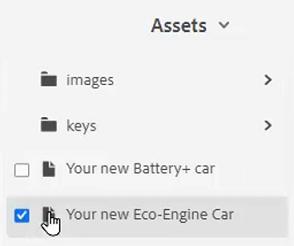
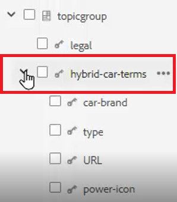
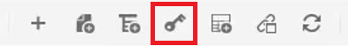
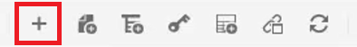
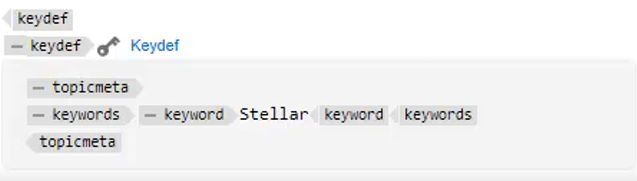

# Tangenter

Olika materialuppsättningar kan innehålla liknande information som behöver anpassas på vissa platser. Med tangenter kan du inkludera variabelinformation i när du arbetar med DITA.

Exempelfiler som du kan välja att använda för den här lektionen finns i filen [keys.zip](assets/keys.zip).

>[!VIDEO](https://video.tv.adobe.com/v/342756)

## Aktivera tangenter

1. Överför uppsättningen med exempelfiler.

   a. Ladda zip-filen.

   b. Uppdatera AEM.

   c. Välj den fil som ska extraheras.

   

   d. Klicka [!UICONTROL **Extrahera arkiv**] i det övre verktygsfältet.

   

   e. I dialogrutan väljer du den specifika platsen för filer som ska extraheras, till exempel en mapp som heter Tangenter.

   f. Klicka [!UICONTROL **Nästa**].

   g. Hoppa över eventuella konflikter eftersom de inte finns för innehåll som aldrig har överförts tidigare.

   h. Välj [!UICONTROL **Extract**] längst upp till höger på skärmen.

2. När extraheringen är klar klickar du på [!UICONTROL **Gå till målmappen**].

   

## Lös nycklar till refererade värden

För att använda tangenter på rätt sätt måste användarinställningarna referera till en viss karta som rotkarta. I den här kartan finns en samling nycklar som grupperats tillsammans i en ämnesgrupp. När du öppnar kartan och avsnitten tolkas tangenterna till de värden som kartan refererar till.

1. Ange en rotkarta.

   a. Öppna en karta på skärmen Tangenter.

   b. Konfigurera användarinställningar.

   c. Klicka på [!UICONTROL **Användarinställningar**] ikonen i det övre verktygsfältet.

   

   d. Klicka på tangentikonen för att ange en **Rotschema** som används för att matcha nycklar.

   e. Markera kryssrutorna för de resurser du vill använda.

   

   f. Klicka [!UICONTROL **Välj**].

   g. **Spara** användarinställningarna.

2. Navigera till **Kartvy**.

3. Öppna den angivna kartan.

Tangenterna är lösta.

## Lägga till en ny nyckelruta manuellt

1. Öppna en karta med en angiven rotkarta.

2. Välj en tangent.

   

3. Infoga ett nytt nyckelord.

   a. Klicka på en giltig plats på kartan.

   b. Välj **Keydef** ikonen i det övre verktygsfältet.

   

   c. I dialogrutan Infoga nyckelord anger du ett unikt värde för Tangenter som passar den definition du skapar.

   d. Klicka [!UICONTROL **Infoga**].

4. Lägg till topicmeta i nyckelordet.

   a. Klicka på [!UICONTROL **Infoga element**] ikonen i det övre verktygsfältet.

   

   b. I dialogrutan Infoga element söker du efter och väljer &quot;topicmeta&quot;.

5. Lägg till nyckelord i ämnesmetan.

   a. Klicka på [!UICONTROL **Infoga element**] ikonen i det övre verktygsfältet.

   

   b. I dialogrutan Infoga element söker du efter och väljer &quot;nyckelord&quot;.

6. Lägg till ett nyckelord i ämnesmetan.

   a. Klicka på [!UICONTROL **Infoga element**] ikonen i det övre verktygsfältet.

   

   b. I **Infoga element** dialogruta, söka efter och markera &quot;nyckelord&quot;

7. Skriv värdet för nyckelordet i nyckelordet.

På kartan ska din nyckeldef nu se ut ungefär så här:

## Konfigurera ett nyckelord som ett fragment

Kodavsnitt är små innehållsfragment som kan återanvändas i olika ämnen i dokumentationsprojektet. I stället för att generera varje nyckelord manuellt kan du konfigurera en enskild nyckeldef som ett fragment.

1. Markera ett nyckelordselement på kartan.

2. På snabbmenyn klickar du på [!UICONTROL **Skapa fragment**].

3. I dialogrutan Nytt fragment lägger du till en titel och en beskrivning.
Du kan också ta bort befintliga nycklar eller nyckelordsdefinitioner från innehållet.

4. Klicka [!UICONTROL **Skapa**].

5. Välj **Fragment**.

6. Dra och släpp det fragment du nyss skapade från fragmentpanelen på kartan.

7. Uppdatera nyckelordet efter behov med Content Properties.
När du sparar och uppdaterar den här uppsättningen nycklar är de tillgängliga för alla användare som har definierat en karta som innehåller samma rotkarta.
