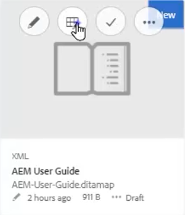
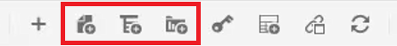
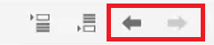
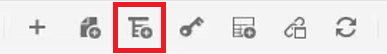
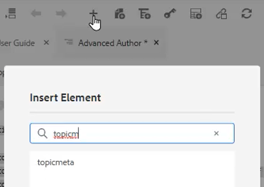
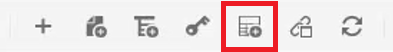
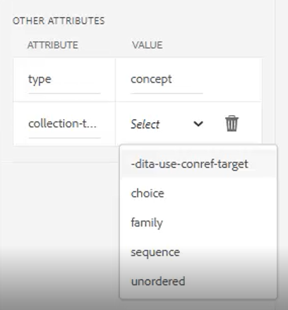

# Kartor och bokkartor

Med Adobe Experience Manager Guides karteditor kan du skapa och redigera kartefiler. Med Kartredigeraren kan du redigera två typer av filer - DITA-karta och bokkarta. För våra syften bör dessa anses vara i stort sett utbytbara begrepp.
Kartredigeraren finns i två lägen - den grundläggande kartredigeraren och den avancerade karteditorn.

>[!VIDEO](https://video.tv.adobe.com/v/342766)

## Skapa en karta

AEM Guides innehåller två färdiga mallar för kartor - DITA-karta och bokkarta. Du kan också skapa egna mappningsmallar och dela dem med författarna för att skapa mappningsfiler.

Utför följande steg för att skapa en kartfil.

1. I resursgränssnittet navigerar du till den plats där du vill skapa kartfilen.

2. Klicka [!UICONTROL **Skapa > DITA-karta**].

3. På sidan Design väljer du den typ av kartmallar som du vill använda och klickar på [!UICONTROL **Nästa**].

4. På sidan Egenskaper anger du en **Titel** och **Namn** för kartan.

5. Klicka [!UICONTROL **Skapa**].

## Öppna en karta med Avancerad kartredigerare

1. I **Resurser, användargränssnitt** markerar du kartan som ska redigeras.

2. Klicka [!UICONTROL **Redigera ämnen**].

   

eller

1. Håll muspekaren över kartikonen.

2. Välj **Redigera ämnen** från **Åtgärd** -menyn.

## Lägga till innehåll i en karta eller bokmapp

1. Navigera till **Databasvy**.

2. Dra och släpp innehåll från databasvyn till giltiga platser på kartan eller bokmappen.

eller

1. Klicka på en giltig plats på kartan eller bokmappen.

2. Klicka på lämplig [!UICONTROL **Ikon för verktygsfält**] om du vill lägga till kapitel, ämnen eller ämnesreferenser.

   

3. Välj en eller flera resurser som du vill lägga till.

4. Klicka [!UICONTROL **Välj**].

### Befordra eller nedgradera element på en karta

Använd **Pilar i verktygsfält** om du vill befordra eller nedgradera kapitel och ämnesreferenser på en karta eller bokkarta.

1. Markera ett element på kartan.

2. Klicka på [!UICONTROL **Vänsterpil**] om du vill befordra en utskrift till ett kapitel eller [!UICONTROL **Högerpil**] om du vill nedgradera ett kapitel till en topicref.

   

3. Spara och versionshantera kartan om det behövs.

eller

1. Dra och släpp element för att ordna om dem.

## Lägga till metadata i en karta

1. Från **Kartverktygsfältet** infogar du en ämnesgrupp.

   

2. Klicka på [!UICONTROL **Plus-ikon**] för att infoga element.

3. Välj de element som ska infogas.

   

4. Klicka [!UICONTROL **Stäng**].

## Lägga till en relativ till en karta

Du kan lägga till en relativ när en karta har strukturerats.

1. Klicka på den plats på kartan där du vill infoga den relaterade tabellen.

2. Använd **Ikon för verktygsfält** om du vill lägga till den relaterade tabellen på kartan.

   

3. Konfigurera dialogrutan.

4. Klicka [!UICONTROL **Infoga**].

5. Dra och släpp önskade ämnen från **Databas** i reläet.

6. Kopiera och klistra in nödvändiga element från kartan i den relaterade tabellen med standardkortkommandon.

## Tilldela attribut till ämnesreferenser på en karta

1. Markera en topicref-samling eller en kapslad samling med topicrefs på kartan.

2. Välj ett alternativ under Andra attribut på panelen Innehållsegenskaper **Attribut** och **Värde.**

   
