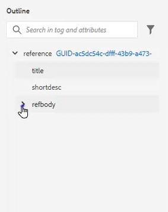
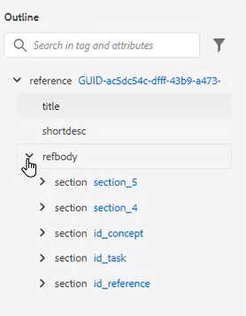
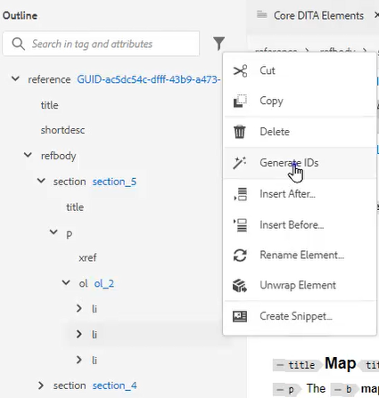
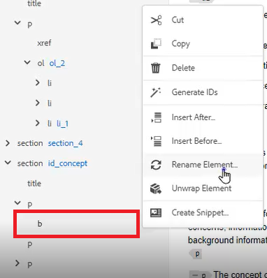
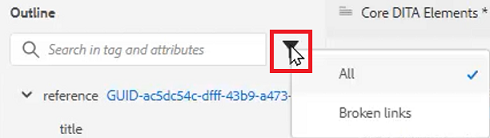
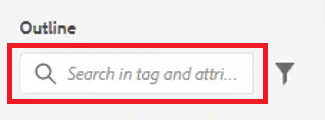

# Dispositionsvy

Dispositionsvyn har ett brett stöd när du arbetar med ett strukturerat dokument. Expandera och komprimera vyn, navigera i strukturen, arbeta med attribut (t.ex. för att skapa ett nytt ID) och ordna om, dela upp och strukturera om element med en enkel musklickning.

>[!VIDEO](https://video.tv.adobe.com/v/342767)

## Expandera och komprimera dispositionsvyn

Elementen kan expanderas för att visa underordnade element eller komprimeras efter behov.

1. Klicka på lämplig ikon för att expandera eller komprimera dispositionsvyn.

   

   

Konturvyn växlar från utökad till komprimerad.

## Navigera i dispositionsvyn

1. Klicka på ett element för att hoppa till den platsen.

2. Klicka på [!UICONTROL **Ellips**] bredvid ett element för att komma åt kortkommandoalternativ.

   

## Tilldela ett ID med hjälp av dispositionsvyn

Ett nytt ID kan genereras automatiskt baserat på systemkonfigurationen. Med innehållsegenskaperna kan ID:t och dess värde också uppdateras om det behövs.

1. Klicka på [!UICONTROL **Ellips**] bredvid ett element.

2. Välj **Generera ID:n**.

   

ID tilldelas. Uppdateringar av innehållsegenskaper och element- och attributinformation visas.

## Ordna om element genom att dra och släppa

Elementen kan ordnas om i dispositionsvyn.

1. Klicka och dra ett element till en annan plats i dispositionsvyn.

2. Släpp elementet ovanpå ett annat element om du vill ersätta det. Den här åtgärden indikeras av en fyrkantig ruta runt det element som ska ersättas.

   eller

   Släpp elementet mellan två andra element om du vill ändra dess plats. Den här åtgärden indikeras av en rad mellan element där det nya elementet kommer att tas bort.

## Byta namn på ett element

1. Markera elementet.

2. Klicka på [!UICONTROL **Ellips**].

3. Välj **Byt namn på element**.

   

4. Dubbelklicka på ett nytt elementnamn.

Elementet har nu bytt namn.

## Dela upp ett element

1. Markera elementet som du vill dela upp.

2. Klicka på [!UICONTROL **Ellips**].

3. Välj [!UICONTROL **Dela upp element**].

Innehållet finns kvar men strukturen har tagits bort.

## Filtrera innehåll med hjälp av dispositionsvyn

1. Klicka på [!UICONTROL **Filter**] -ikonen bredvid sökfältet i dispositionsvyn.

   

2. Välj antingen **Alla** för att visa alla element eller **Brutna länkar** för att hitta och åtgärda brutna referenser.

## Sök i dispositionsvyn

En sökning kan begränsas och returnera resultat baserat på ett element, attribut eller värde.

1. Skriv namnet på elementet som du vill söka efter i sökfältet.

   

2. Välj det resultat som bäst passar dina behov.
