# Paneler

Webbredigeraren AEM stödlinjer är uppdelad i flera avsnitt, bland annat ett huvudverktygsfält, ett sekundärt verktygsfält, en vänster panel, ett område för innehållsredigering och en höger panel.

>[!VIDEO](https://video.tv.adobe.com/v/342760)

## Ändra storlek på den vänstra panelen

Beständiga paneler som den vänstra panelen kan ändras i storlek.

1. Placera markören på panelkanten.

2. När dubbelpilen visas klickar du och drar inåt eller utåt efter behov.

## Expandera eller komprimera sidofältet i den vänstra panelen

I den utökade vyn visas namnen och ikonerna som visas som verktygstips i den komprimerade vyn.

1. Klicka på [!UICONTROL **Sidebar**] om du vill expandera panelen.

   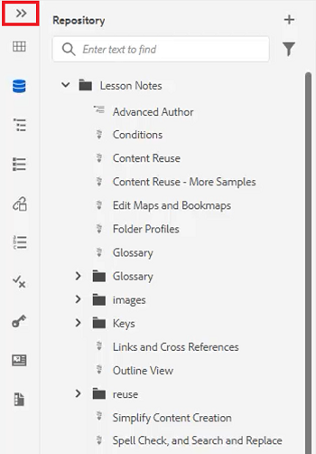

2. Klicka på [!UICONTROL **Sidebar**] om du vill komprimera panelen igen.

   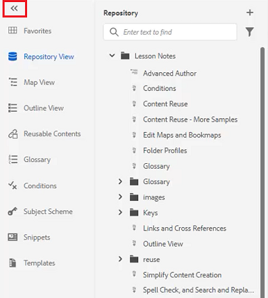

## Skapa en favoritsamling

I den vänstra panelen kan du med Favoriter skapa en lista med specifika dokument och lägga till i den över tiden. Du kan skapa och hantera en bred samling med favoriter.

1. Välj **Favoriter** till vänster.

2. Klicka på [!UICONTROL **Plus**] ikon.

   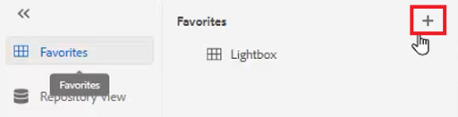

3. I dialogrutan Ny samling anger du en **Titel** och **Beskrivning**.

   Observera att när du väljer Offentlig innebär det att andra användare kan se den här favoriten.

4. Klicka [!UICONTROL **Skapa**].

Du har nu skapat en Favoriter-samling.

## Lägga till en fil i en Favoriter-samling från databasen

När du har skapat en samling kan du börja lägga till favoriter i den.

1. Välj **Databasvy** till vänster.

2. Klicka på [!UICONTROL **Ellips**] som finns bredvid ett ämne för att komma åt sammanhangsberoende alternativ.

3. Välj **Lägg till i** > **Favoriter**.

4. I dialogrutan Lägg till i Favoriter väljer du **Ny samling** eller **Befintlig samling**.

   Här väljer vi att lägga till i en befintlig samling.

   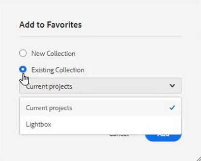

5. Välj en samling i listrutan om det behövs.

6. Klicka [!UICONTROL **Lägg till**].

Avsnittet läggs till i den favoritsamling du väljer. Du kan visa den på menyn Favoriter.

## Lägga till en fil i en favoritsamling från Redigeraren

Ett annat sätt att lägga till ett ämne i dina favoriter är från ett öppet ämne i Redigeraren.

1. Navigera till **Databasvy**.

2. Dubbelklicka på ett ämne för att öppna det.

3. Högerklicka på filens **Titelflik** i redigeraren för att komma åt sammanhangsberoende alternativ.

4. Välj **Lägg till i** > **Favoriter**.

   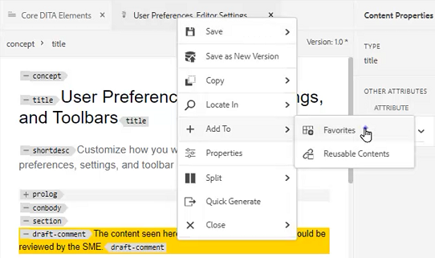

5. I dialogrutan Lägg till i Favoriter väljer du **Ny samling** eller **Befintlig samling**.

   Här väljer vi att lägga till i en ny samling.

6. I dialogrutan Ny samling anger du en **Titel** och **Beskrivning**.

   Observera att markera **Offentlig** innebär att andra användare kan se den här favoriten.

7. Klicka [!UICONTROL **Skapa**].

Den nya favoriten har skapats och grupperats. Du kan visa den på menyn Favoriter.

## Visa och hantera dina favoriter

Det är enkelt att visa vilka ämnen du redan har lagt till i dina favoritsamlingar.

1. Välj [!UICONTROL **Favoriter**] till vänster.

2. Under Favoriter klickar du på [!UICONTROL **Pil**] -ikonen bredvid en samling för att visa dess innehåll.

   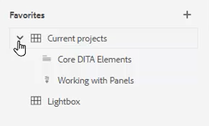

3. Klicka på [!UICONTROL **Ellips**] bredvid ett ämne för att visa sammanhangsberoende alternativ, inklusive alternativet att ta bort det från favoritlistan.

## Filtrera en sökning i databasvyn

Med det förbättrade filtret i databasen kan du söka efter text med en mängd olika begränsningar.

1. Navigera till **Databasvy**.

2. Klicka på [!UICONTROL **Filtersökning**] ikon.

   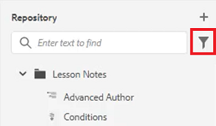

3. Skriv text i den markerade banan eller välj en ny bana om det behövs.

   Listan med filer uppdateras när du skriver text i filtret.

4. Klicka på pilikonen bredvid en sökkategori om du vill begränsa sökningen ytterligare.

   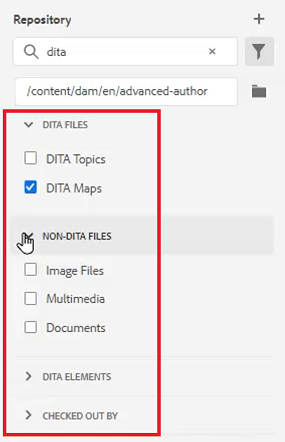

Sökningar kan begränsas till DITA-avsnitt eller DITA-kartor. Du kan söka i bildfiler, multimedia eller andra dokument som inte är DITA-filer i den valda sökvägen. Du kan till och med begränsa sökningen till DITA Elements eller filtrera efter filutcheckning.

## Utforska Kartvyn

Det finns flera användbara funktioner i Kartvyn, bland annat möjlighet att checka ut och låsa filer, förhandsgranska kartfilen, öppna Kartkontrollpanelen och visa kartan i resursgränssnittet.

Se lektionen under rubrik [Kartor och bokkartor](./maps-and-bookmaps.md) i den här kursen om du vill ha mer information om Kartvyn och dess funktioner.

## Utforska dispositionsvyn

I dispositionsvyn finns en hierarkisk vy över det aktuella dokumentet i dispositionsvyn. Du kan expandera dispositionsvyn om du vill visa flera element samt eventuella tilldelade ID:n.

Se lektionen under rubrik [Dispositionsvy](./outline-view.md) om du vill ha mer information om dispositionsvyn och dess funktioner.

## Arbeta med återanvändbart innehåll

Den centrala DITA-funktionen är möjligheten att återanvända innehåll, från små fraser till hela ämnen eller kartor. Redigeraren har ett dra-och-släpp-gränssnitt för återanvändning av innehåll.

Se lektionen under rubrik [Återanvändning av innehåll](./content-reuse.md) i den här kursen får du mer information om återanvändbart innehåll och hur du hanterar det effektivt.

## Arbeta med ordlistor

Om du använder ordlistan blir det enklare att använda samma frasinformation och läsaren får bättre klarhet. Redigeraren har ett dra-och-släpp-gränssnitt där du kan infoga ordlistor i ett ämne.

Se lektionen under rubrik [Ordlista](./glossary.md) om du vill ha mer information om hur du konfigurerar och använder ordlistor.

## Arbeta med villkor

I DITA styrs villkoren ofta av attribut som Produkt, Plattform och Målgrupp, som kan ha specifika värden tilldelade. Villkoren hanteras via mappprofiler.

Se lektionen under rubrik [Villkor](./conditions.md) om du vill ha mer information om hur du konfigurerar och använder villkorsattribut.

## Skapa ett fragment

Fragment är små innehållsfragment som kan återanvändas som utgångspunkt för innehåll eller struktur. Med Kodfragment minskas den tid som krävs för att skapa innehåll och materialets strukturella kvalitet och konsistens förbättras.

1. Öppna ett ämne i Redigeraren.

2. Markera ett element i ämnet.

3. Klicka på den sekundära musknappen i elementet.

4. Välj Skapa på menyn som visas [!UICONTROL **Fragment**].

   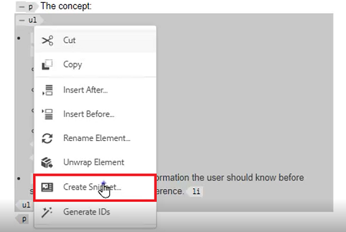

5. I dialogrutan Nytt fragment lägger du till en **Titel** och **Beskrivning**.

6. Redigera fragmentet efter behov.

   Observera att en sammanhangsbaserad kontroll meddelar dig visuellt om du infogar ett fel i innehållet.

7. Klicka [!UICONTROL **Skapa**].

Fragmentet läggs till i listan med tillgängliga fragment. Den är klar att dras och släppas på en giltig plats i ämnet.

## Arbeta med mallar

Med hjälp av mallpanelen kan administratörer enkelt skapa och hantera mallar som författarna kan använda. Som standard kategoriseras mallarna som Karta och Ämnestyp.

Se lektionerna [Mappprofiler](./folder-profiles.md) och [Arbetsflöden för att skapa enkelt innehåll](simple-content-creation-workflows.md) om du vill ha mer information om hur du konfigurerar och använder mallar.

## Sök efter filer med Sök och ersätt

Det finns två alternativ för Sök och ersätt i Redigeraren. Den första funktionen tillåter Sök och ersätt-funktioner i ett visst öppet ämne, ungefär som en vanlig ordbehandlare. Den andra är en Sök och ersätt-panel som söker efter text i flera filer i databasen.

Se lektionen under rubrik [Stavningskontrollera och sök och ersätt](./spell-check.md)  om du vill ha mer information om funktionen Sök och ersätt.

## Uppdatera innehållsegenskaper

Egenskaper för innehåll på den högra panelen innehåller specifik information om det markerade elementet, till exempel attribut-ID och värde.

1. Öppna ett ämne i **XML Editor**.

2. Välj en **element**.

   Innehållsegenskaper visar elementets aktuella typ och attribut.

3. Ange en ny **Värde** för elementet.

   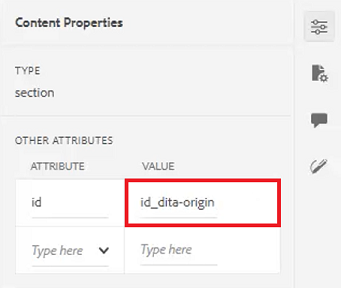

Innehållsegenskaper uppdateras dynamiskt när du gör ändringar i element.

## Lägga till ett ämne på en karta med hjälp av filegenskaper

Filegenskaper visar ytterligare information om hela det öppna avsnittet. En del av informationen styrs av Ämnesegenskaper. Ändringar i annat material, t.ex. Dokumentstatus, kan vara beroende av behörigheter.

1. Öppna ett ämne i Redigeraren.

2. Klicka på [!UICONTROL  **Filegenskaper**] på den högra panelen.

   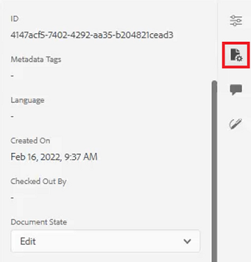

3. Ange **Dokumenttillstånd** till **Redigera**. Observera att listan med referenser är tom.

   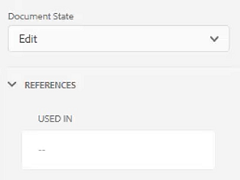

4. Stäng ämnet.

5. Välj [!UICONTROL **Databasvy**] till vänster.

6. Öppna en karta.

   Vyn ändras till Kartvy.

7. Klicka på [!UICONTROL **Redigera**] ikon.

   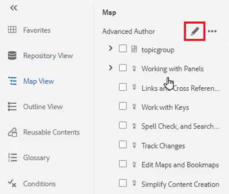

8. När kartan är öppen för redigering växlar du tillbaka till **Databasvy**.

9. Dra och släpp det ämne du arbetar med på kartan.

10. Klicka på [!UICONTROL **Spara**] ikonen i det övre verktygsfältet.

Ämnet läggs till på kartan. När du nu öppnar ämnet och markerar filegenskaperna, kan du se att Referenser uppdateras för att återspegla att ämnet används på den angivna kartan.

## Skapa en granskningsuppgift

Den högra panelen innehåller en genväg till granskningsflödet.

1. Klicka på [!UICONTROL **Granska**] på den högra panelen.

   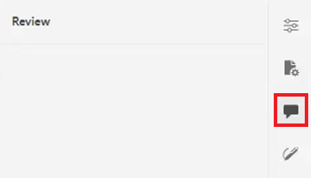

2. Klicka [!UICONTROL **Skapa granskning**].

   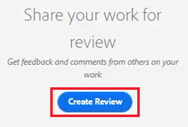

3. Fyll i fälten efter behov i dialogrutan Skapa granskningsuppgift.

4. Klicka på [!UICONTROL **Nästa**].

Granskningsaktiviteten skapas.

## Spåra ändringar

Möjligheten att spåra ändringar ger dig stor kontroll över vilka ändringar som behålls i en version av ett ämne till nästa. Du kan använda den högra panelen för att hantera spårade ändringar.

Se lektionen under rubrik [Spåra ändringar](./track-changes.md) i den här kursen om du vill ha mer information om funktionen för ändringsspårning.
