# Arbetsflöden för att skapa enkelt innehåll

AEM Guides Editor har flera genvägar som gör det enklare att skapa innehåll. Med dessa genvägar kan användare snabbt lägga till och ändra bilder, arbeta med flera ämnen samtidigt, korrigera fel, ladda ned PDF och arbeta med versioner och etiketter.

>[!VIDEO](https://video.tv.adobe.com/v/342770)

## Lägga till en bild

Du kan lägga till bilder direkt från en lokal enhet.

1. Dra och släpp bilden direkt i ämnet. The **Överför resurser** visas.

   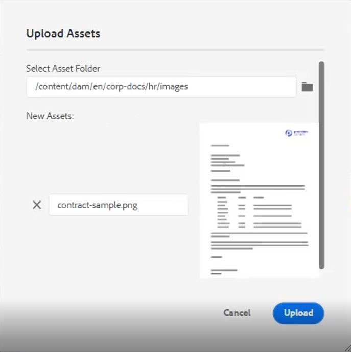

2. Ändra mappsökvägen till önskad bildplats.

3. Ändra bildens namn till något som motsvarar dess syfte.

4. Klicka [!UICONTROL **Överför**].

## Ändra en bild

1. Ändra storlek på en bild genom att dra och släppa ett hörn.

2. Flytta en bild till en annan plats i ämnet genom att dra och släppa den.

3. Använd **Innehållsegenskaper** på den högra panelen för att ändra en bilds

   ・ skala

   • position

   ・ justering, eller

   ・ andra attribut.

   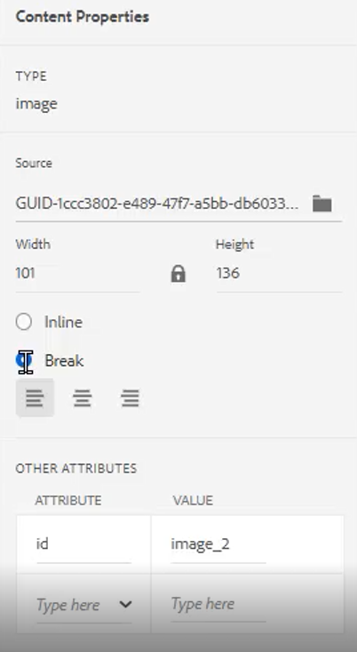

## Arbeta med flera ämnen

Delad vy är användbart när du jämför ämnen, kopierar och klistrar in mellan ämnen eller drar och släpper innehåll från ett ämne till ett annat.

1. Öppna två eller flera relaterade ämnen.

2. Klicka på en fils titelflik för att öppna snabbmenyn.

3. Välj [!UICONTROL **Dela**].

4. Välj **Höger**.

   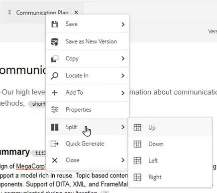

## Korrigera typografiska fel

1. Leta reda på ordet eller frasen som innehåller felet.

2. Tryck och håll [!UICONTROL **Ctrl**].

3. Klicka på den sekundära musknappen på felet.

4. Välj rätt stavning.

Felet har korrigerats i avsnittstexten.

## Ladda ned ett ämne PDF

Användare kan vilja ladda ned en PDF i det aktuella ämnet för att kommentera eller dela med andra.

1. Klicka [!UICONTROL **Förhandsgranska**] längst upp till höger på skärmen.

2. Klicka på [!UICONTROL **PDF, ikon**] ovanför ämnet. En dialogruta visas.

   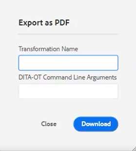

3. Fyll i informationen för antingen **Transformeringsnamn** eller **Kommandoradsargument för DITA-OT** vid behov. Observera att PDF fortfarande genereras om alla fält lämnas tomma.

4. Klicka [!UICONTROL **Hämta**]. PDF genererar.

5. Använd tillgängliga ikoner för att konfigurera, hämta eller dela ämnet i PDF.

## Leta reda på ett ämne i databasen eller kartan

1. Öppna ämnet.

2. Klicka på den sekundära musknappen på fliken Titel.

3. Välj **Sök i**.

4. Välj antingen **Databas** eller **Karta** för att gå till den önskade ämnesplatsen.

## Version av ett ämne

1. Ändra ett ämne.

2. Spara ämnet.

3. Klicka på **Databas** ikonen i den övre vänstra menyn.

   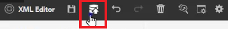

4. Lägg till **Kommentarer för ny version**.

   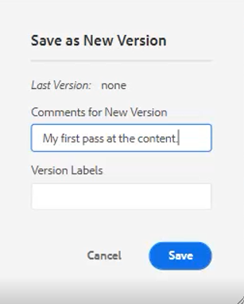

5. Klicka [!UICONTROL **Spara**].

Versionsnumret uppdateras.

## Läs in versionsetiketter

Det kan vara svårt att spåra ett ämnes tillstånd baserat på endast versionsnumret. Etiketter gör det enklare att identifiera exakt status för ett ämne som har genomgått flera revisioner.

1. Välj en **Mappprofil**.

2. Konfigurera XML-redigeraren i mappprofilen.

   a. Välj Redigera längst upp till vänster på skärmen.

   b. Lägg till ett nytt ämne eller använd ett befintligt under Versionsetiketter för XML-innehåll.

   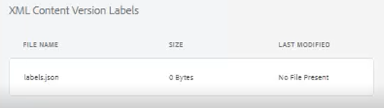

3. Välj [!UICONTROL **Överför**].

4. Välj en fil som ReviewLabels.json eller liknande. Mer information om hur du skapar en sådan fil finns i en annan video.

5. Klicka [!UICONTROL **Öppna**].

6. Klicka [!UICONTROL **Spara**] längst upp till vänster på skärmen Mappprofil.

7. Klicka [!UICONTROL **Stäng**] överst till höger.

Versionsetiketter har lästs in.

## Tilldela versionsetiketter

1. Läs in versionsetiketter.

2. Klicka på [!UICONTROL **Användarinställningar**] ikonen längst upp till vänster i det aktuella avsnittet.

   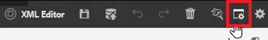

3. Välj samma mappprofil där versionsetiketter tidigare lästes in.

4. I dialogrutan Användarinställningar kontrollerar du att bassökvägen refererar till samma information som mappprofilen har tillämpats på.

   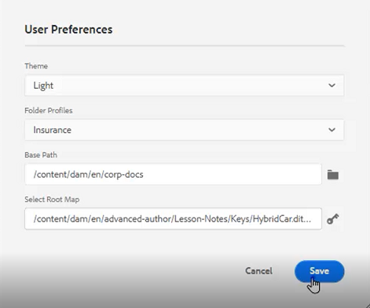

5. Klicka [!UICONTROL **Spara**].

6. Version av ämnet.

7. Lägg till en kommentar och välj en versionsetikett i listrutan.

   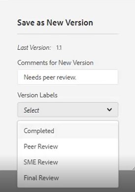

8. Klicka [!UICONTROL **Spara**].

Versionsnumret uppdateras.

## Visa versionshistorik och etiketter

1. På den vänstra panelen letar du reda på aktuell ämnesrubrik.

2. Klicka på titeln för att öppna snabbmenyn.

3. Välj [!UICONTROL **Visa i resursgränssnitt**].

   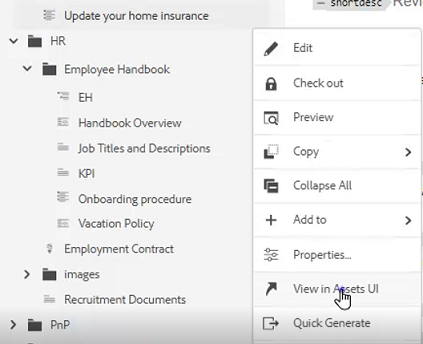

   - Versionshistoriken med etiketter visas till vänster.

   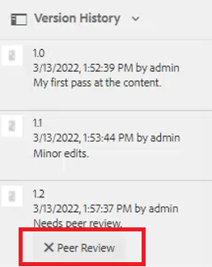

4. Klicka på en version för att komma åt alternativ som **Återgå till den här versionen** och **Förhandsgranska version**.

## Skapa en ny mall

Det finns mallar för både ämnen och kartor. Administratörer har åtkomst till mallar i den vänstra panelen.

1. Klicka [!UICONTROL **Mallar**] i den vänstra panelen.

2. Välj antingen Karta eller Ämne för att öppna den associerade snabbmenyn.

3. Klicka för att lägga till den nya mallen.

   

4. Fyll i fälten i den resulterande dialogrutan.

Skalmallen visas med exempelinnehåll och en exempelstruktur.
