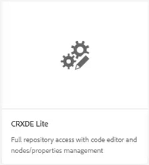
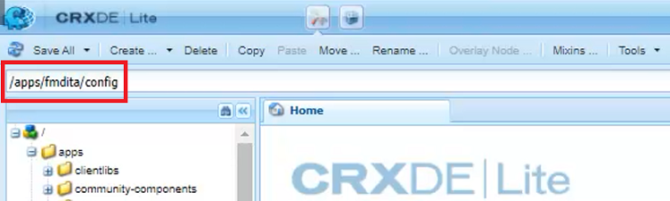
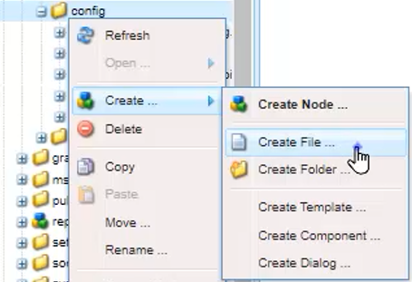
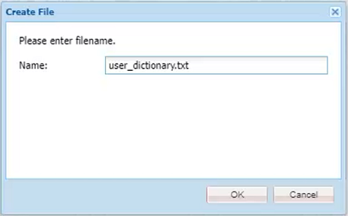
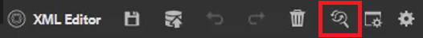
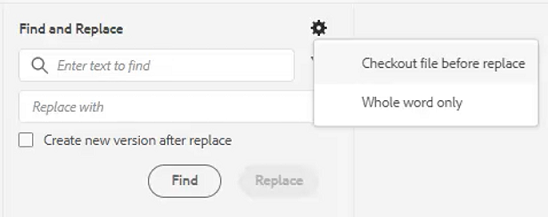
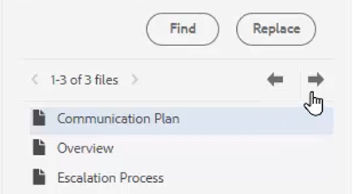

# Stavningskontroll och sök/ersätt

AEM Guides Editor har kraftfulla funktioner för stavningskontroll och Sök och ersätt.

>[!VIDEO](https://video.tv.adobe.com/v/342768?quality=12&learn=on)

Korrigera ett stavfel

1. Leta upp ett fel i ett öppet ämne som visas med en röd understrykning.

2. Håll ned Ctrl och klicka på den andra musknappen i ordet.

3. Välj rätt stavning bland förslagen.

Om rätt stavning inte föreslås kan du alltid redigera ordet manuellt.

## Växla till AEM stavningskontroll

Du kan använda ett annat stavningskontrollverktyg än webbläsarens standardordlista.

1. Navigera till **Inställningar för Redigeraren**.

2. Välj **Allmänt** inställningsflik.

   

3. Det finns två alternativ:

   - **Stavningskontroll för webbläsare** — standardinställningen där stavningskontrollen använder webbläsarens inbyggda ordlista.

   - **AEM stavningskontroll** — använd detta för att skapa en egen ordlista med AEM egna ordlistan.

4. Välj **AEM stavningskontroll**.

5. Klicka [!UICONTROL **Spara**].

Konfigurera en egen ordlista

Administratören kan ändra inställningarna så att den AEM ordlistan känner igen anpassade ord som företagsnamn.

1. Navigera till **verktyg** fönster.

2. Logga in på **CRXDE Lite**.

   

3. Navigera till **_/apps/fmdita/config node_**.

   

4. Skapa en ny fil.

   a. Högerklicka på konfigurationsmappen.

   b. Välj **Skapa > Skapa fil**.

   

   c. Namnge filen _**user_dictionary.txt**_.

   

   d. Klicka [!UICONTROL **OK**].

5. Öppna filen.

6. Lägg till en lista med ord som du vill ta med i din egen ordlista.

7. Klicka [!UICONTROL **Spara alla**].

8. Stäng filen.

Författare kan behöva starta om sin Web Editor-session för att få den uppdaterade anpassade ordlistan i AEM.

## Söka och ersätta i en enda fil

1. Klicka på ikonen Sök och ersätt i det övre verktygsfältet.

   

2. Skriv ett ord eller en fras i det nedre verktygsfältet.

3. Klicka [!UICONTROL **Sök**].

4. Om det behövs skriver du ett ord som ska ersätta det ord som hittas.

5. Klicka [!UICONTROL **Ersätt**].

## Sök och ersätt i databasen

1. Navigera till **Databas**.

2. Klicka på [!UICONTROL **Sök och ersätt**] ikonen längst ned till vänster på skärmen.

3. Klicka på [!UICONTROL **Visa inställningar**] ikon.

4. Välj antingen

   - **Checka ut filen före ersättning** — Om det är aktiverat av en administratör checkas filen ut automatiskt innan söktermerna ersätts.

   - **Endast hela ord** — begränsar sökningen så att endast det angivna ordet eller frasen returneras.

   

5. Klicka på [!UICONTROL **Använd filter**] om du vill markera den sökväg i databasen där du vill utföra sökningen.

6. Ange de termer du vill söka efter och ersätta.

7. Välj **Skapa ny version efter ersättning**.

8. Klicka [!UICONTROL **Sök**].

9. Öppna den önskade filen och använd pilarna för att navigera mellan de olika resultaten.

   
