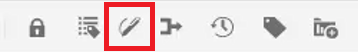
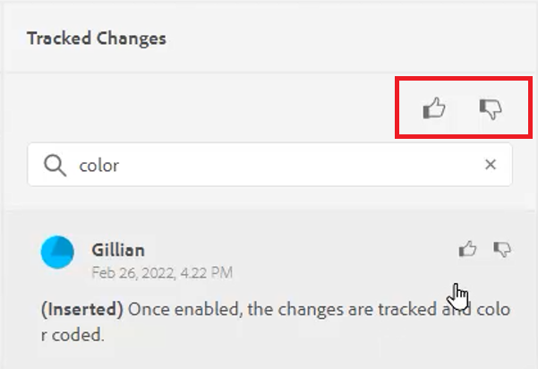
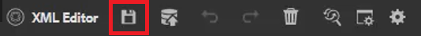
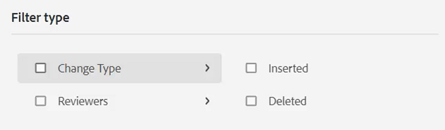
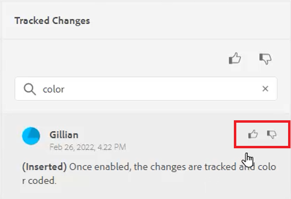
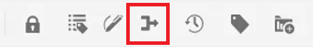

# Spåra ändringar

Du kan hålla reda på alla uppdateringar som gjorts i ett dokument genom att aktivera läget Spåra ändringar. I det här läget kan du och ditt team fånga in alla infogningar och borttagningar under dokumentgranskningsprocessen.

>[!VIDEO](https://video.tv.adobe.com/v/342763)

## Arbeta med funktionen Spåra ändringar

1. Växla **Spåra ändringar** ikon i verktygsfältet för att aktivera (eller inaktivera) funktionen.

   

2. Gör en ändring i ämnet.

   Innehåll som har lagts till visas nu i grönt med ett ändringsfält. Borttaget innehåll visas i rött med genomstrykning.

3. Välj **Spårade ändringar** till höger för att komma åt panelen Spårade ändringar.

   

4. Klicka [!UICONTROL **Spara**].

   

5. Stäng ämnet.

Andra användare kan nu öppna ämnet och visa befintliga spårade ändringar. De kan acceptera eller ignorera ändringarna och lägga till egna.

## Söka efter spårade ändringar

Sökfunktionen är användbar när det finns många spårade ändringar, eftersom det kan ta lång tid att bläddra igenom dem.

1. Välj **Spårade ändringar** till höger för att komma åt panelen Spårade ändringar.

2. Skriv ett ord eller en fras i sökfältet.
Sökningen returnerar alla ändringar som matchar sökorden.

## Filtrera spårade ändringar

Flera spårade ändringar kan också filtreras genom infogning, borttagning eller granskare.

1. Klicka på [!UICONTROL **Filter**] längst ned på panelen Spårade ändringar.

2. Markera kryssrutorna för de önskade filtren.

   

3. Klicka [!UICONTROL **Använd**].

## Acceptera eller ignorera spårade ändringar

Granskare och ämnesexperter kan acceptera eller ignorera andra användares ändringar, antingen individuellt eller alla samtidigt.

1. Klicka på [!UICONTROL **Spårade ändringar**] till höger för att komma åt panelen Spårade ändringar.

2. Välj en specifik ändring.

3. Klicka på [!UICONTROL **Tummen uppåt**] eller [!UICONTROL **Tummen nedåt**] ikon som är associerad med ändringen för att acceptera eller ignorera den.

   

   eller

   Klicka på [!UICONTROL **Tummen uppåt**] eller [!UICONTROL **Tummen nedåt**] ikonen ovanför sökfältet om du vill acceptera eller ignorera alla ändringar.

   

4. [!UICONTROL **Spara**] ämnet.

## Arbeta med sammanfogningsfunktionen

När du arbetar i en miljö med flera författare kan det vara svårt att spåra vilka ändringar andra författare har gjort i ett ämne eller en karta. Med sammanfogningsfunktionen får du bättre kontroll över inte bara hur ändringarna visas, utan även vilka ändringar som finns i den senaste versionen av dokumentet.

1. Öppna ett ämne i Web Editor.

2. Klicka på [!UICONTROL **Sammanfoga**] -ikonen i verktygsfältet.

   

3. I dialogrutan Sammanfoga väljer du en version av filen som du vill jämföra den aktuella versionen av filen med.

4. Välj:

   ・ **Spåra ändringar från vald version**: Det här alternativet visar alla innehållsuppdateringar i form av spårade ändringar. Du kan sedan välja att acceptera eller ignorera ändringar i dokumentet en åt gången eller alla samtidigt.

   ・ **Återställ till markerad version**: Med det här alternativet återställs den aktuella versionen av dokumentet till den valda versionen. Det ger ingen kontroll över vilket innehåll som godkänns eller avvisas.

5. Klicka [!UICONTROL **Klar**].

Om du valde **Spåra ändringar från vald version, alternativ** visas alla ändringar från den markerade versionen på fliken Ändringar i den högra panelen.
